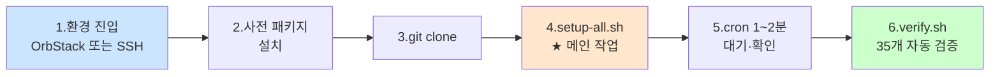

# codyssey_b1_1 — 시스템 관제 자동화 스크립트

> Codyssey B1-1 과제 산출물 레포. 학습 노트는 별도 레포 [codyssey_notes](https://github.com/codewhite7777/codyssey_notes/tree/main/codyssey_b1_1_study)에 보관.

**상태**: 🟢 코드 작성 완료 (setup 8개 + bin 2개 스크립트) — 평가 환경에서 실행·검증 대기

## 과제 개요

- **분야**: AI/SW 기초 · Linux와 OS
- **시간**: 40h
- **핵심**: 다중 사용자 Linux 환경에서 보안·권한·자원 관측을 자동화하는 운영 엔지니어링

자세한 명세는 [docs/spec.md](./docs/spec.md) 참조 (Codyssey 원본 verbatim 보존).

## 레포 구조

```
codyssey_b1_1/
├── README.md                # 이 파일
├── docs/
│   ├── spec.md              # Codyssey 원본 명세
│   └── 수행내역서.md         # 산출물 1 (구현 단계에서 작성)
├── bin/
│   ├── monitor.sh           # 핵심 산출물 ✓
│   └── report.sh            # 보너스 (로그 통계) ✓
├── setup/
│   ├── 01-ssh.sh            # SSH 포트·root 차단 ✓
│   ├── 02-firewall.sh       # ufw 설정 ✓
│   ├── 03-users-groups.sh   # 계정·그룹 생성 ✓
│   ├── 04-directories.sh    # 디렉토리·ACL ✓
│   ├── 05-environment.sh    # 환경 변수·키 파일 ✓
│   ├── 06-cron.sh           # cron + logrotate ✓
│   ├── setup-all.sh         # 통합 실행 + 배포 ✓
│   └── verify.sh            # 명세 검증 자동화 (35개 항목) ✓
├── evidence/                # 스샷·명령 출력 증거
└── .gitignore
```

## 평가 환경 셋업 & 실행

### 전체 흐름

평가 환경 종류와 무관하게 다음 6단계를 따른다. 단계 1만 환경별로 차이.



OrbStack 환경에서 처음 시작한다면 단계 1 앞에 **VM 생성** 한 번이 더 필요 (아래 시나리오 A 참조).

### 왜 VM (Linux Machine) 인가? — Docker 컨테이너가 아닌 이유

명세는 "컨테이너 또는 VM"을 모두 허용하지만, 이 과제의 요구가 **시스템 데몬 중심**이라 실용적으로 **VM이 표준**이다.

#### 명세 요구와 환경 매핑

| 명세 요구 | 필요한 시스템 기능 |
|---|---|
| SSH 포트 변경 + sshd 재시작 (#1) | systemd로 sshd 데몬 관리 |
| ufw 방화벽 (#2) | netfilter/iptables 직접 조작 |
| cron 매분 실행 (#6) | cron 데몬 + systemd timer |
| logrotate (#6) | `/etc/cron.daily/` 자동 실행 |

이 4개 요구가 모두 **운영체제 수준의 데몬·커널 기능**을 요구한다. Docker 컨테이너는 본래 "단일 애플리케이션 실행"에 최적화된 구조라 위 기능들이 기본 비활성이거나 제약된다.

#### Docker 컨테이너 vs Linux Machine (VM)

| 항목 | Docker 컨테이너 | **Linux Machine (VM)** ★ |
|---|---|---|
| systemd (init) | 기본 비활성 — `--privileged` + 특수 이미지 필요 | 완전 동작 |
| sshd 데몬 | systemd 없이는 까다로움 (foreground 실행) | `systemctl start ssh` 한 줄 |
| ufw 방화벽 | iptables를 호스트와 공유 → 권한 제약·간섭 | 머신 독립적, 자유롭게 조작 |
| cron 데몬 | 기본 안 돌아감 — 별도 시작 스크립트 필요 | 설치 후 즉시 동작 |
| 환경 동등성 | 컨테이너 ≠ 진짜 서버 | **클러스터 평가 환경과 거의 동일** |
| OrbStack 생성 명령 | `docker run ...` | `orb create ubuntu:22.04 <이름>` |

→ Docker 컨테이너로 진행하면 **추가 설정 부담**이 명세 학습 자체보다 커진다. 또한 클러스터의 실제 평가 환경(Ubuntu 22.04 VM)과 동일성을 확보하려면 VM이 자연스럽다.

#### 그래도 컨테이너로 하고 싶다면

가능은 하지만 권장하지 않음. 다음 추가 작업이 필요하다:
- `--privileged` 또는 세밀한 capability 부여 (`--cap-add=NET_ADMIN`, `--cap-add=SYS_ADMIN`)
- systemd가 동작하는 base 이미지(예: `jrei/systemd-ubuntu`) 사용
- cgroup·`/sys/fs/cgroup` 마운트 옵션 조정

이번 과제의 학습 목표(시스템 운영)에서 **벗어난 노이즈**가 늘어나므로 VM 추천.

> [!IMPORTANT]
> OrbStack의 **Linux Machine은 가벼운 VM** — Mac 위에서 거의 컨테이너 속도로 부팅되면서도 진짜 systemd Ubuntu를 제공한다. "VM은 무겁다"는 통념은 OrbStack에선 거의 해당 없음.

### 사전 요구사항

| 항목 | 요구 |
|---|---|
| OS | **Ubuntu 22.04 LTS** (또는 동등 리눅스) |
| 권한 | `sudo` 사용 가능 사용자 |
| 네트워크 | `apt` + `git` 접근 가능 |
| 디스크 | 최소 1 GB 여유 |

### 시나리오 A — OrbStack (로컬 평가)

Mac에 OrbStack이 설치된 환경에서 새 Ubuntu VM을 띄워 실행.

```bash
# 1) Mac에서 — Ubuntu 22.04 VM 생성
orb create ubuntu:22.04 codyssey-b1-1

# 2) VM 진입 (-m 플래그가 zsh의 하이픈 토큰화 함정을 피함)
orb shell -m codyssey-b1-1

# 3) VM 안에서 — 진짜 홈으로 이동 (시작 위치는 Mac 마운트 경로)
cd ~

# 이후는 시나리오 B의 "공통 실행 흐름"과 동일
```

> [!NOTE]
> OrbStack은 Mac 사용자와 같은 이름의 사용자를 VM에 자동 생성(sudo NOPASSWD). `orb shell -m`으로 진입 시 시작 위치가 `/Users/<name>`(Mac 홈 자동 마운트)이라 헷갈릴 수 있음 — `cd ~`로 VM의 진짜 홈(`/home/<name>`)으로 이동 권장.

### 시나리오 B — 클러스터/원격 Ubuntu (실제 평가)

학습환경 클러스터·일반 VM·EC2 등 Ubuntu 22.04 머신에 SSH로 접속한 환경.

```bash
ssh <user>@<host>
```

### 공통 실행 흐름

OrbStack VM이든 클러스터 머신이든 진입한 뒤부터는 동일한 절차.

```bash
# 1) 사전 패키지 설치 — Ubuntu minimal 이미지에 누락 가능
sudo apt update
sudo apt install -y git ufw openssh-server cron logrotate procps iproute2

# 2) 레포 clone
cd ~
git clone https://github.com/codewhite7777/codyssey_b1_1.git
cd codyssey_b1_1

# 3) 시스템 설정 일괄 적용 (★ 메인 작업)
sudo bash setup/setup-all.sh

# 4) agent-app 실행 (별도 터미널에서)
sudo -u agent-admin -i
python $AGENT_HOME/agent_app.py
# Ctrl+C로 종료

# 5) cron 자동 실행 확인 (★ 명세 요구 — 1~2분 대기 후 누적 확인)
sleep 90
sudo tail -20 /var/log/agent-app/monitor.log

# 6) 종합 검증 (35개 항목 자동 점검)
sudo bash setup/verify.sh
```

### 사전 패키지 — 무엇이 왜 필요한가

명세는 패키지 설치를 명시적으로 요구하진 않지만, minimal 이미지(OrbStack Ubuntu 등)에는 누락된 경우가 있음. 각 패키지가 어떤 명세 요구와 매핑되는지:

| 패키지 | 명세 매핑 |
|---|---|
| `git` | 레포 clone |
| `ufw` | 방화벽 (요구 #2) |
| `openssh-server` | sshd (요구 #1) |
| `cron` | 매분 자동 실행 (요구 #6) |
| `logrotate` | 로그 회전 (요구 #6) |
| `procps` | `ps`·`top` (monitor.sh) |
| `iproute2` | `ss` 명령 (verify.sh) |

### 개별 단계 실행

setup-all.sh가 6단계를 순차 실행하지만, 디버깅 시 개별 실행 가능 (모두 멱등).

```bash
sudo bash setup/01-ssh.sh         # SSH 포트 20022 + root 차단
sudo bash setup/02-firewall.sh    # ufw default deny + 20022/15034 허용
sudo bash setup/03-users-groups.sh  # agent-admin/dev/test + agent-core/common
sudo bash setup/04-directories.sh # AGENT_HOME·로그 디렉토리·ACL
sudo bash setup/05-environment.sh # .bash_profile + AGENT_* 환경 변수
sudo bash setup/06-cron.sh        # cron 등록 + logrotate 정책
```

### 보너스 — 로그 통계 리포트

```bash
bash bin/report.sh                                              # 전체 로그
bash bin/report.sh "2026-05-11 00:00" "2026-05-11 23:59"        # 시간 범위
```

### SSH 포트 변경 후의 안전 주의

`setup/01-ssh.sh`가 sshd 포트를 22 → 20022로 바꾸고 재시작함. 진입 환경에 따라 영향이 다름:

| 환경 | 영향 |
|---|---|
| OrbStack VM | ✅ 안전 — `orb shell`은 sshd 우회, 항상 진입 가능 |
| SSH 원격 접속 | ⚠ 현재 SSH 세션은 유지되지만, 새 접속은 `ssh -p 20022`로 |

원격 환경에서 작업 시 안전 패턴: 다른 터미널에서 미리 새 세션을 하나 더 열어두고 작업.

### 트러블슈팅

| 증상 | 원인 후보 |
|---|---|
| `git: command not found` | 사전 패키지 미설치 — 위 1) 단계 실행 |
| `ufw: command not found` | 동일 |
| `Permission denied` | sudo 권한 부족 또는 sshd 재시작 후 새 포트로 재접속 필요 |
| cron이 monitor.log를 안 채움 | `cron` 데몬 미실행 → `sudo systemctl start cron` |
| verify.sh 실패 | 어떤 항목인지 확인 → 학습 노트의 해당 주제 참조 |

## 설계 원칙

- **멱등성**: 모든 setup 스크립트는 여러 번 실행해도 동일 결과
- **`set -euo pipefail`**: 모든 스크립트가 안전 모드로 시작
- **명시적 sudo**: root 권한이 필요한 명령만 sudo
- **자동 검증**: setup-all.sh 끝에 verify.sh 자동 실행
- **cron 환경 함정 회피**: monitor.sh가 PATH·LC_ALL 명시

## 학습 노트 (별도 레포)

이 과제와 관련된 학습 자산은 [codyssey_notes/codyssey_b1_1_study/](https://github.com/codewhite7777/codyssey_notes/tree/main/codyssey_b1_1_study) 에 있다. 21개 노트, 5개 Layer 구성:

| Layer | 주제 | 노트 |
|---|---|---|
| 1. Linux Foundation | 파일·사용자·환경·프로세스 | filesystem-tree, users-and-groups, file-permissions, shell-environment, process-and-signals |
| 2. 보안 & 네트워킹 | SSH·방화벽·포트·ACL | ssh-deep-dive, sshd-config, ports-and-listening, firewall-ufw-vs-firewalld, posix-acl |
| 3. 자원 측정 | CPU·MEM·DISK 모니터링 | cpu-measurement, memory-measurement, disk-usage-df-vs-du |
| 4. Bash 스크립팅 | 기초·안전·흐름·치환·trap | bash-fundamentals, bash-set-safe, bash-control-flow, bash-substitution, bash-trap |
| 5. 자동화 & 로그 | cron·로그 회전 | cron-fundamentals, cron-environment-gotchas, log-rotation |

모든 노트는 "과제 요구사항 → 구현 방법 → 개념" 동일 패턴 + 회사 비유 + Mermaid 다이어그램으로 작성. verify.sh가 실패할 때 어느 노트로 가야 풀리는지 매핑되어 있음.

## 개발 환경

- Ubuntu 22.04 LTS (OrbStack Linux Machine 또는 동등)
- Bash (스크립트 작성 — Python 등 대체 금지)
- 일반 사용자 계정 (필요 시에만 sudo)

## 라이선스

학습 산출물 — 자유 참고.
