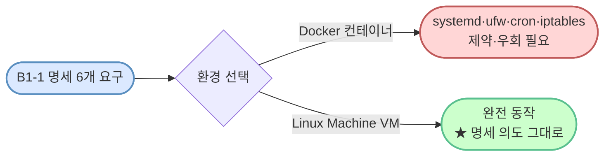
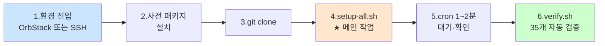

# codyssey_b1_1 — 시스템 관제 자동화 스크립트

> Codyssey B1-1 과제 산출물 레포. 학습 노트는 별도 레포 [codyssey_notes](https://github.com/codewhite7777/codyssey_notes/tree/main/codyssey_b1_1_study)에 분리 보관.

**상태**: 🟢 코드 작성 완료 (setup 8개 + bin 2개 스크립트) — 평가 환경에서 실행·검증 대기

## 과제 개요

- **분야**: AI/SW 기초 · Linux와 OS
- **시간**: 40h
- **핵심**: 다중 사용자 Linux 환경에서 보안·권한·자원 관측을 자동화하는 운영 엔지니어링

### 한 줄로 — 이 과제는 무엇?

> agent-app(서비스) 을 안전한 환경에 배치하고, monitor.sh(CCTV) 가 매분 자동 감시하며,
> logrotate(보존 정책) 가 기록을 관리하는 **완성된 관제 시스템 1세트를 구축**한다.

### 명세 6개 영역 한눈에

| # | 영역 | 핵심 | 구현 |
|---|---|---|---|
| 1 | SSH 보안 | Port 20022 + root 차단 | `setup/01-ssh.sh` |
| 2 | 방화벽 | ufw 20022·15034 만 허용 | `setup/02-firewall.sh` |
| 3 | 사용자·그룹 | admin/dev/test + common/core 역할 분리 | `setup/03-users-groups.sh` |
| 4 | 디렉토리·권한 | AGENT_HOME 구조 + setgid | `setup/04-directories.sh` |
| 5 | 환경 변수 | `.bash_profile` AGENT_* + 키 파일 | `setup/05-environment.sh` |
| 6 | cron·logrotate | 매분 monitor.sh + 10MB/10 파일 | `setup/06-cron.sh` |

### 명세 풀이 가이드

- **원본 명세**: [docs/spec.md](./docs/spec.md) (Codyssey 원본 그대로 보존)
- **풀이 가이드**: [**docs/spec-overview.md**](./docs/spec-overview.md) — 6개 영역 각각의 *무엇 / 왜 / 어떻게* + 회사 비유 + Mermaid 다이어그램 + 자기평가 항목 매핑
- **스크립트 줄별·문법 풀이**: [**docs/scripts-walkthrough/**](./docs/scripts-walkthrough/) — 각 `.sh` 파일의 모든 줄·옵션·정규식을 처음 보는 사람도 이해할 수 있게 분해 (옵션 표·Mermaid·회사 비유·FAQ 포함)

## 환경 — 왜 VM 이고 컨테이너가 아닌가

명세는 "Ubuntu 22.04 LTS 또는 동등 리눅스(**컨테이너/VM**)" 를 모두 허용하지만, 실제로 명세 6개 요구가 모두 **시스템 데몬·커널 기능**이라 **VM 이 의도를 그대로 실현하는 유일한 환경**에 가깝다.



### 명세 6 영역 요구 ↔ 시스템 능력 매핑

| # | 명세 요구 | 필요한 시스템 능력 | Docker | **VM** |
|---|---|---|:---:|:---:|
| 1 | SSH 포트 변경 + sshd 재시작 | systemd 로 sshd 데몬 관리 | ⚠ 특수 이미지 | ✅ |
| 2 | ufw 방화벽 | netfilter·iptables 직접 조작 | ⚠ 호스트와 공유 | ✅ |
| 3 | 사용자·그룹 생성 | useradd, NSS, /etc/passwd 쓰기 | ✅ | ✅ |
| 4 | 디렉토리·setgid | 시스템 디렉토리 권한 | ✅ | ✅ |
| 5 | 환경 변수 (`.bash_profile`) | 사용자 홈 파일 쓰기 | ✅ | ✅ |
| 6 | cron 매분 + logrotate | cron 데몬 + cron.daily | ❌ 기본 안 돌아감 | ✅ |

→ **#1·#2·#6 의 3 항목이 컨테이너에선 본질적 제약**. 우회는 가능하지만 학습 본질에서 벗어남.

### Docker 컨테이너 vs Linux Machine (VM) 정면 비교

| 항목 | Docker 컨테이너 | **Linux Machine (VM)** ★ |
|---|---|---|
| **systemd (init)** | 기본 비활성 — `--privileged` + systemd-enabled 이미지 필요 | 완전 동작 |
| **sshd 데몬** | systemd 없이는 foreground 실행 등 까다로움 | `systemctl start ssh` 한 줄 |
| **ufw 방화벽** | iptables 를 호스트와 공유 → 권한 제약·다른 컨테이너와 간섭 | 머신 독립적, 자유롭게 조작 |
| **cron 데몬** | 기본 안 돌아감 — 별도 시작 스크립트 필요 | 설치 후 즉시 동작 |
| **환경 동등성** | 컨테이너 ≠ 진짜 서버 | **클러스터 평가 환경과 거의 동일** |
| **OrbStack 생성** | `docker run ...` | `orb create --arch amd64 ubuntu:24.04 ...` |
| **부팅 속도** | ~1초 | OrbStack VM 도 **수 초** (Apple Silicon Mac 기준) |

### 회사 비유

| 환경 | 비유 |
|---|---|
| **Docker 컨테이너** | 공유 사무실의 **책상 한 자리**. 인프라(전화선·CCTV·소방 시스템)는 건물 전체와 공유, 자기 책상만 격리. 작은 작업은 OK 지만 "직접 전화선 깔겠다·소방 시스템 만지겠다" 같은 요구는 제약 많음. |
| **Linux Machine (VM)** | **독립 사무실**. 전화선·CCTV·소방 모두 자기 것. 명세의 *서버 운영 환경 구축* 의도 그대로 실현 가능. |

### "그래도 컨테이너로 하고 싶다면"

가능은 하지만 비권장. 다음 추가 작업이 필요하다:

- `--privileged` 또는 정밀한 capability 부여 (`--cap-add=NET_ADMIN`, `--cap-add=SYS_ADMIN`)
- systemd 가 동작하는 base 이미지 (예: `jrei/systemd-ubuntu`)
- cgroup·`/sys/fs/cgroup` 마운트 옵션 조정
- ufw 가 호스트 iptables 와 충돌하지 않게 격리

이 모든 추가 작업이 **명세 학습 본질(시스템 운영)에서 벗어난 노이즈**다. 평가 환경 동일성도 떨어진다.

### 결론

> **OrbStack Linux Machine 또는 Codyssey 평가 클러스터 — 둘 다 진짜 systemd Ubuntu VM. 컨테이너 모드는 명세 의도와 안 맞으니 사용하지 않는다.**
>
> Apple Silicon Mac 에서도 OrbStack VM 은 **컨테이너 수준의 부팅 속도**라 "VM 은 무겁다" 는 통념이 사실상 해당 없음.

OrbStack VM 생성·진입의 구체적 흐름은 **[시나리오 A](#시나리오-a--orbstack-로컬-평가)** 참조.

## 레포 구조

```
codyssey_b1_1/
├── README.md                # 이 파일
├── docs/
│   ├── spec.md              # Codyssey 원본 명세
│   └── 수행내역서.md         # 구현 과정 기록
├── bin/
│   ├── monitor.sh           # 핵심 산출물 — health check + 자원 측정
│   └── report.sh            # 보너스 — 로그 통계 리포트
├── setup/
│   ├── 01-ssh.sh            # SSH 포트 20022 + root 차단
│   ├── 02-firewall.sh       # ufw — 20022·15034 허용
│   ├── 03-users-groups.sh   # agent-admin/dev/test + agent-core/common
│   ├── 04-directories.sh    # AGENT_HOME·로그 디렉토리·ACL
│   ├── 05-environment.sh    # .bash_profile + AGENT_* 환경 변수
│   ├── 06-cron.sh           # cron 매분 등록 + logrotate 정책
│   ├── setup-all.sh         # 6단계 통합 실행 + monitor.sh 배포
│   └── verify.sh            # 명세 검증 자동화 (35개 항목)
├── evidence/                # 실행 증거 (스크린샷·명령 출력)
└── .gitignore
```

## 평가 환경 셋업 & 실행

### 전체 흐름

평가 환경 종류와 무관하게 다음 6단계를 따른다. 1단계의 **진입 방법**만 환경별로 다르고, 이후는 동일.



OrbStack 환경에서 처음 시작한다면 1단계 앞에 **VM 생성**이 한 번 더 필요 (시나리오 A 참조).

### 사전 요구사항

| 항목 | 요구 |
|---|---|
| OS | **Ubuntu 22.04 LTS** (또는 동등 리눅스) |
| 아키텍처 | **amd64 (x86_64)** — 제공 agent-app 바이너리가 amd64 ELF |
| GLIBC | **≥ 2.38** — agent-app 의 Python 런타임 의존 (Ubuntu 24.04 기본 충족) |
| 권한 | `sudo` 사용 가능 사용자 |
| 네트워크 | `apt` + `git` 접근 가능 |
| 디스크 | 최소 1 GB 여유 |

> [!IMPORTANT]
> **GLIBC 버전 — Ubuntu 22.04 에서는 agent-app 이 실행 불가**
>
> 제공된 `agent-app` 바이너리는 GLIBC 2.38 이상을 요구 (Ubuntu 24.04 빌드 환경 기준).
> Ubuntu 22.04 의 GLIBC 는 2.35 이라 해당 심볼이 OS 자체에 **존재하지 않음** —
> 실행 즉시 `version 'GLIBC_2.38' not found` 로 종료되며, 어떤 환경 변수·옵션으로도 우회 불가능.
>
> | OS | GLIBC | agent-app 실행 |
> |---|---|---|
> | Ubuntu 22.04 | 2.35 | ❌ 실행 불가 |
> | Ubuntu 24.04 | 2.39 | ✅ |
>
> 명세는 "Ubuntu 22.04 LTS **또는 동등 리눅스**"를 허용하므로 **Ubuntu 24.04 사용**.
> 단, 22.04 에서도 setup·monitor.sh·verify.sh 등 **다른 모든 명세 요구는 정상 동작**한다 —
> agent-app 실행만 24.04 필요.
>
> 확인 명령: `ldd --version | head -1`

### 시나리오 A — OrbStack (로컬 평가)

Mac에 OrbStack이 설치된 환경에서 새 Ubuntu VM을 띄워 실행한다.

```bash
# 1) Mac에서 — Ubuntu 24.04 amd64 VM 생성
#    --arch amd64 가 핵심 (Apple Silicon Mac 에서도 amd64 강제)
#    24.04 는 GLIBC 2.39 로 agent-app 의 GLIBC 2.38 요구 충족
orb create --arch amd64 ubuntu:24.04 codyssey-b1-1

# 2) VM 진입 (-m 플래그가 zsh의 하이픈 토큰화 함정을 피함)
orb shell -m codyssey-b1-1

# 3) VM의 진짜 홈으로 이동 (시작 위치는 Mac 마운트 경로)
cd ~
```

> [!NOTE]
> OrbStack은 Mac 사용자와 같은 이름의 사용자를 VM에 자동 생성한다(`sudo NOPASSWD` 포함). 진입 직후 시작 위치가 `/Users/<name>`인 이유는 Mac 홈이 자동 마운트되기 때문 — `cd ~`로 VM의 실제 홈(`/home/<name>`)으로 이동.

> 환경 선택의 *왜* 는 README 앞쪽의 **[환경 — 왜 VM 이고 컨테이너가 아닌가](#환경--왜-vm-이고-컨테이너가-아닌가)** 섹션 참조.

### 시나리오 B — 클러스터/원격 Ubuntu (실제 평가)

학습환경 클러스터·일반 VM·EC2 등 Ubuntu 22.04 머신에 SSH로 접속한다.

```bash
ssh <user>@<host>
```

### 공통 실행 흐름

OrbStack VM이든 클러스터 머신이든 진입한 뒤부터는 동일한 절차다.

#### 1) 사전 패키지 설치

Ubuntu minimal 이미지(OrbStack Ubuntu 등)는 필수 도구가 누락된 경우가 있어 먼저 설치한다.

```bash
sudo apt update
sudo apt install -y git ufw openssh-server cron logrotate procps iproute2
```

각 패키지가 어떤 명세 요구와 매핑되는지:

| 패키지 | 명세 매핑 |
|---|---|
| `git` | 레포 clone |
| `openssh-server` | sshd (요구 #1) |
| `ufw` | 방화벽 (요구 #2) |
| `cron` | 매분 자동 실행 (요구 #6) |
| `logrotate` | 로그 회전 (요구 #6) |
| `procps` | `ps`·`top` (monitor.sh) |
| `iproute2` | `ss` 명령 (verify.sh) |

#### 2) 레포 clone

```bash
cd ~
git clone https://github.com/codewhite7777/codyssey_b1_1.git
cd codyssey_b1_1
```

#### 3) 시스템 설정 일괄 적용 (★ 메인 작업)

```bash
sudo bash setup/setup-all.sh
```

setup-all.sh는 6단계를 순차 실행하고 마지막에 verify.sh로 자체 검증한다. 모두 멱등하므로 여러 번 실행해도 안전.

> [!WARNING]
> 이 단계에서 sshd 포트가 22 → 20022로 변경된다. SSH 원격 접속 환경이라면 **현재 세션은 유지되지만 새 접속은 `ssh -p 20022`로** 들어가야 한다. 안전을 위해 다른 터미널에서 미리 세션을 하나 더 열어두기를 권장. (OrbStack은 `orb shell`이 sshd를 우회하므로 영향 없음.)

#### 4) agent-app 배치 + 실행

agent-app 은 Codyssey 가 제공하는 **PyInstaller 로 빌드된 단일 ELF 바이너리** (Python 인터프리터·코드·의존 패키지가 모두 묶여 있음). 명세는 `$AGENT_HOME/agent-app` 위치에서 agent-admin 권한으로 실행됨을 가정.

**4-1) 바이너리 install** (Mac → VM, 호스트마다 SRC 경로 다름)
```bash
SRC=/Users/<your-mac-username>/Downloads/agent-app
DST=/home/agent-admin/agent-app/agent-app
sudo install -m 750 -o agent-admin -g agent-core "$SRC" "$DST"
sudo ls -l "$DST"
```

> [!NOTE]
> OrbStack 환경에선 Mac 의 `/Users/<name>/` 가 VM 안에 자동 마운트되어 같은 경로로 보임 (virtiofs).
> 클러스터·원격 SSH 환경에선 `scp` 또는 평가 운영 채널로 전송 필요.

**4-2) 실행 (★ `-i bash -c` 패턴 — env 보존 핵심)**

agent-app 은 시작 시 `AGENT_HOME` · `AGENT_KEY_PATH` 등 환경 변수를 검사한다. 다음 명령은 모두 **실패**:
```bash
sudo -u agent-admin "$DST"        # ❌ sudo 가 env reset → AGENT_HOME missing
```

올바른 패턴 — `-i` 가 login 셸로 `.bash_profile` 자동 source → AGENT_* 환경 변수 전달:
```bash
# (a) 포그라운드 확인 (Ctrl+C 로 종료)
sudo -u agent-admin -i bash -c '"$AGENT_HOME/agent-app"'

# (b) 백그라운드 실행 (운영용)
sudo -u agent-admin -i bash -c 'nohup "$AGENT_HOME/agent-app" > /tmp/agent-app.out 2>&1 &'
```

**4-3) 실행 확인**
```bash
pgrep -fa agent-app                       # PID + 명령줄
sudo ss -ltnp | grep ':15034 '            # LISTEN 확인
sudo tail /tmp/agent-app.out              # 부팅 로그
```

기대 출력 — "All Boot Checks Passed! Agent READY" + "listening at port 15034".

#### 5) cron 자동 실행 확인 (명세 요구)

cron이 1분에 한 번 monitor.sh를 실행하므로, 등록 후 1~2분 대기 후 누적을 확인한다.

```bash
sleep 90
sudo tail -20 /var/log/agent-app/monitor.log
```

매분 한 줄씩 자원 측정 결과(`CPU Usage`, `MEM Usage`, `DISK Used`)가 누적되어 있어야 한다.

#### 6) 종합 검증

```bash
sudo bash setup/verify.sh
```

35개 항목을 자동으로 점검한다. 모두 `[OK]`면 명세 충족.

### 개별 단계 실행 (디버깅 시)

setup-all.sh가 6단계를 순차 실행하지만, 한 단계만 다시 돌리고 싶을 때는 개별 실행 가능 (모두 멱등).

```bash
sudo bash setup/01-ssh.sh           # SSH 포트 20022 + root 차단
sudo bash setup/02-firewall.sh      # ufw default deny + 20022/15034 허용
sudo bash setup/03-users-groups.sh  # 사용자·그룹 생성
sudo bash setup/04-directories.sh   # 디렉토리·ACL
sudo bash setup/05-environment.sh   # .bash_profile + AGENT_* 환경 변수
sudo bash setup/06-cron.sh          # cron + logrotate
```

### 보너스 — 로그 통계 리포트

monitor.log를 시간 범위로 집계해서 평균·최대 사용률을 보여준다.

```bash
bash bin/report.sh                                              # 전체 로그
bash bin/report.sh "2026-05-11 00:00" "2026-05-11 23:59"        # 시간 범위
```

### 트러블슈팅

| 증상 | 원인 후보 |
|---|---|
| `git: command not found` | 사전 패키지 미설치 — 1) 단계 실행 |
| `ufw: command not found` | 동일 |
| `Permission denied` | sudo 권한 부족 또는 sshd 재시작 후 새 포트(`-p 20022`)로 재접속 필요 |
| `cron`이 monitor.log를 안 채움 | cron 데몬 미실행 → `sudo systemctl start cron` |
| `verify.sh` 일부 항목 FAIL | 실패 항목의 주제를 학습 노트에서 찾아 참조 |
| `agent-app: Exec format error` | 아키텍처 미스매치 — VM 이 ARM64 인데 바이너리 x86_64. `orb create --arch amd64 ...` 로 amd64 VM 사용 |
| `version 'GLIBC_2.38' not found` | OS 의 GLIBC 가 너무 옛 버전. `ldd --version` 으로 확인 → Ubuntu 24.04 등 더 새 OS 로 VM 재생성 |
| `[sudo] password for ...` (다른 사용자 전환 시) | OrbStack NOPASSWD 는 일반 sudo 만 적용. `sudo -i` 로 root 셸 먼저 진입 후 그 안에서 `sudo -u other_user ...` |
| agent-app 실행 시 `Critical Env 'AGENT_HOME' is missing` | `sudo -u agent-admin <bin>` 형태는 env 를 reset → AGENT_* 안 전달. `sudo -u agent-admin -i bash -c '...'` 패턴으로 login 셸 통해 `.bash_profile` source 필요 |
| `Missing privilege separation directory: /run/sshd` (24.04 신규 환경) | openssh-server 막 설치되어 sshd 데몬 한 번도 안 뜸 → `setup/01-ssh.sh` 가 자동 `mkdir -p /run/sshd` 로 처리. 옛 코드면 `git pull` 로 갱신 |

## 설계 원칙

- **멱등성**: 모든 setup 스크립트는 여러 번 실행해도 동일 결과
- **`set -euo pipefail`**: 모든 스크립트가 안전 모드로 시작
- **명시적 sudo**: root 권한이 필요한 명령에만 sudo
- **자동 검증**: setup-all.sh 끝에 verify.sh 자동 실행
- **cron 환경 함정 회피**: monitor.sh가 PATH·LC_ALL을 명시적으로 set

## 학습 노트 (별도 레포)

이 과제와 관련된 학습 자산은 [codyssey_notes/codyssey_b1_1_study/](https://github.com/codewhite7777/codyssey_notes/tree/main/codyssey_b1_1_study)에 있다. 21개 노트, 5개 Layer 구성:

| Layer | 주제 | 노트 |
|---|---|---|
| 1. Linux Foundation | 파일·사용자·환경·프로세스 | filesystem-tree, users-and-groups, file-permissions, shell-environment, process-and-signals |
| 2. 보안 & 네트워킹 | SSH·방화벽·포트·ACL | ssh-deep-dive, sshd-config, ports-and-listening, firewall-ufw-vs-firewalld, posix-acl |
| 3. 자원 측정 | CPU·MEM·DISK 모니터링 | cpu-measurement, memory-measurement, disk-usage-df-vs-du |
| 4. Bash 스크립팅 | 기초·안전·흐름·치환·trap | bash-fundamentals, bash-set-safe, bash-control-flow, bash-substitution, bash-trap |
| 5. 자동화 & 로그 | cron·로그 회전 | cron-fundamentals, cron-environment-gotchas, log-rotation |

모든 노트가 "과제 요구사항 → 구현 방법 → 개념"의 동일 패턴 + 회사 비유 + Mermaid 다이어그램으로 작성됐고, `verify.sh`가 실패할 때 어떤 노트를 참조해야 할지 매핑되어 있다.

## 개발 환경

- Ubuntu 22.04 LTS (OrbStack Linux Machine 또는 동등)
- Bash 스크립트 (Python 등 대체 금지 — 명세 요구)
- 일반 사용자 계정 + 필요 시 sudo

## 라이선스

학습 산출물 — 자유 참고.
