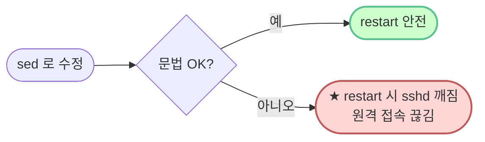

# `setup/01-ssh.sh` — 줄별·문법 풀이

> **한 줄로** · sshd_config 두 줄(Port·PermitRootLogin) 수정 + `/run/sshd` 보장 + 문법 검증 + 재시작. 모두 멱등.
>
> **코드**: [setup/01-ssh.sh](../../setup/01-ssh.sh)
> **관련 학습 노트**: [ssh-deep-dive](https://github.com/codewhite7777/codyssey_notes/blob/main/codyssey_b1_1_study/ssh-deep-dive.md), [sshd-config](https://github.com/codewhite7777/codyssey_notes/blob/main/codyssey_b1_1_study/sshd-config.md)

## 🌳 전체 흐름


---

## Shebang

```bash
#!/usr/bin/env bash
```

| 부분 | 의미 |
|---|---|
| `#!` | "이 파일은 스크립트야" 마커 (shebang) — **파일 첫 줄, 첫 글자** |
| `/usr/bin/env` | "환경 변수 PATH 에서 다음 명령 찾아줘" 헬퍼 |
| `bash` | 우리가 쓸 인터프리터 |

### 왜 `/usr/bin/env bash`?

`#!/bin/bash` 도 가능하지만 macOS·Linux 배포판마다 bash 위치 다를 수 있어. `env` 가 PATH 에서 자동 검색 → 어디서든 동작.

회사 비유: "**한국 어디서나 통하는 표준 주소**" — 직접 주소가 아닌 우편번호 같은 추상화.

---

## `set -euo pipefail` — 안전 모드

```bash
set -euo pipefail
```

bash 의 "엄격 모드" 활성:

| 옵션 | 영어 | 효과 |
|---|---|---|
| `-e` | **e**rrexit | 명령 하나가 실패하면 **즉시 종료** |
| `-u` | **u**nset | 정의 안 된 변수 사용 시 에러 (오타 잡기) |
| `-o pipefail` | pipefail | 파이프 (`A \| B`) 중간 실패도 감지 |

### 왜 엄격하게?

bash 기본은 매우 관대 — 명령 실패해도 다음 줄로 계속. 운영 자동화에선 위험:
- setup 일부 실패해도 "완료"로 끝남
- partial state 남음 → 디버깅 지옥

`set -euo pipefail` 한 줄로 "하나라도 실패하면 즉시 멈춤" 보장.

---

## 변수 정의

```bash
SSHD_CONFIG="/etc/ssh/sshd_config"
```

| 부분 | 의미 |
|---|---|
| `SSHD_CONFIG` | 변수 이름 (대문자 = 관습) |
| `=` | **양쪽 공백 금지** |
| `"..."` | 큰따옴표 (안전한 습관) |

같은 경로를 여러 줄에서 사용 → 한 번 정의 + `$SSHD_CONFIG` 로 참조 (DRY 원칙).

---

## 섹션 1 — `sed` 로 Port 변경 (★ 핵심 문법)

```bash
sudo sed -i 's/^#\?Port .*/Port 20022/' "$SSHD_CONFIG"
```

### `sed` 명령

**S**tream **ED**itor — 텍스트 줄 단위 처리. 가장 흔한 용도가 치환(substitute).

### 옵션 분해

| 부분 | 의미 |
|---|---|
| `sudo` | sshd_config 는 root 소유, 쓰기에 root 권한 필요 |
| `sed` | 명령 |
| `-i` | **in-place** — 파일 자체를 직접 수정 |
| `'s/OLD/NEW/'` | 치환 명령 |
| `"$SSHD_CONFIG"` | 대상 파일 |

### `s/OLD/NEW/` 구조

```
s   /  ^#\?Port .*  /  Port 20022  /
│   │      │           │
│   │      └─ 매칭할 패턴 (정규식)
│   │                  └─ 치환 후 문자열
│   └─ 구분자 (보통 /)
└─ substitute 명령
```

### 정규식 `^#\?Port .*` 분해 (★ 가장 미묘)

| 토큰 | 의미 |
|---|---|
| `^` | **줄 시작** 앵커 |
| `#` | 글자 그대로 '#' |
| `\?` | **앞 문자 0개 또는 1개** |
| `Port ` | 글자 그대로 (공백 포함) |
| `.*` | **어떤 글자든 0개 이상** (나머지 전부) |

### `^#\?` 가 핵심인 이유

원본 sshd_config 의 두 가지 상태를 한 번에 매칭:

| 입력 | `^#\?Port` 매칭? | 치환 결과 |
|---|---|---|
| `Port 22` | ✅ (`#` 0개) | `Port 20022` |
| `#Port 22` | ✅ (`#` 1개) | `Port 20022` |

→ **어떤 초기 상태에서 시작해도 동일 결과** = **멱등**.

### `.*` 가 필요한 이유

`22` 또는 `20022` 처럼 숫자 부분이 다를 수 있음 → 끝까지 매칭해 통째 교체.

### `sed -i` 의 효과

```bash
sed 's/OLD/NEW/' file       # 결과를 stdout 으로 — 파일 안 바뀜
sed -i 's/OLD/NEW/' file    # 파일 자체를 수정 (덮어쓰기)
```

---

## 섹션 2 — root 로그인 차단

```bash
sudo sed -i 's/^#\?PermitRootLogin .*/PermitRootLogin no/' "$SSHD_CONFIG"
```

섹션 1과 **완전히 동일한 패턴**, 단어만 `Port` → `PermitRootLogin`. 정규식 의미·멱등 보장도 동일.

### 명세의 의도

명세는 `PermitRootLogin no` — root 직접 SSH 로그인 차단.
- root 작업 필요하면 일반 계정 → `sudo` 경로로 우회
- 감사 로그·정책 통제 ↑
- 알려진 root 사용자명을 표적으로 한 brute-force 차단

---

## 섹션 3 — `/run/sshd` 보장

```bash
sudo mkdir -p /run/sshd
```

| 부분 | 의미 |
|---|---|
| `sudo` | `/run` 시스템 디렉토리, root 권한 필요 |
| `mkdir` | **m**a**k**e **dir**ectory |
| `-p` | **p**arents — 부모도 자동 + **이미 있어도 에러 X** |

### 왜 `-p` 가 핵심?

```bash
mkdir /run/sshd       # 이미 있으면: "File exists" → set -e 발동 → 스크립트 중단
mkdir -p /run/sshd    # 이미 있으면: 아무 일 안 함, 성공 반환 (멱등)
```

### 이 단계가 왜 필요? (Ubuntu 24.04 함정)

- 24.04 갓 설치 + `openssh-server` 막 설치 = sshd 데몬 한 번도 안 뜸
- 그 결과 `/run/sshd` 디렉토리가 **자동 생성되지 않음**
- 다음 단계 `sshd -t` 가 이 디렉토리 요구 → 없으면 "Missing privilege separation directory" 에러
- `mkdir -p` 한 줄로 회피 (회고 노트 함정 6 참조)

---

## 섹션 4 — 문법 검증 (`sshd -t`)

```bash
if ! sudo sshd -t; then
    echo "[ERROR] sshd_config 문법 오류"
    exit 1
fi
```

### `if ! cmd ; then ... fi` 구조

bash 조건 분기 — `cmd` 가 **실패**하면 then 블록 실행.

| 부분 | 의미 |
|---|---|
| `if` | 조건 분기 시작 |
| `!` | **부정** — 다음 명령의 exit code 반전 |
| `sudo sshd -t` | 검증 명령 |
| `;` | 명령 끝 |
| `then ... fi` | 실패 시 실행 블록 |
| `exit 1` | 스크립트 종료 (실패 코드 1) |

### `sshd -t` 가 하는 일

| 부분 | 의미 |
|---|---|
| `sshd` | SSH 데몬 프로그램 자체 |
| `-t` | **t**est — 문법만 검사, 실제 시작 X |

문법 OK → exit code 0, 오류 → exit code 1+ + 에러 메시지.

### 왜 검증 필수?



sed 가 어떤 이유로 문법을 깨뜨렸다면 (예: 타이포), 검증 안 하고 restart 하면 sshd 가 안 떠 SSH 끊김.

---

## 섹션 5 — 데몬 시작·재시작

```bash
sudo systemctl enable ssh 2>/dev/null || true
sudo systemctl restart ssh 2>/dev/null || sudo systemctl restart sshd
```

### 줄 1: 부팅 시 자동 시작 등록

| 부분 | 의미 |
|---|---|
| `systemctl` | systemd 제어 명령 |
| `enable ssh` | 재부팅 시 자동 시작 등록 |
| `2>/dev/null` | **stderr 버림** (이미 enabled 면 메시지 안 보임) |
| `\|\| true` | 실패해도 OK (set -e 회피) |

### `2>/dev/null` 분해

리눅스의 3개 표준 스트림:

| 번호 | 이름 | 용도 |
|---|---|---|
| 0 | stdin | 입력 |
| 1 | stdout | 일반 출력 |
| 2 | stderr | 에러 출력 |

`2>/dev/null` = "stderr 를 /dev/null (블랙홀) 로" = 에러 메시지 안 보이게.

### 줄 2: 데몬 재시작 + 패키지명 호환

```bash
sudo systemctl restart ssh 2>/dev/null || sudo systemctl restart sshd
```

| 시도 | 결과 |
|---|---|
| `restart ssh` (Ubuntu/Debian) | 실패하면 두 번째 |
| `restart sshd` (RHEL/CentOS) | 백업 |

→ 둘 다 시도해 어느 배포판에서든 동작.

### `enable` vs `restart` 차이

| 명령 | 효과 |
|---|---|
| `enable` | 부팅 시 자동 시작 등록 (즉시 시작 X) |
| `start` | 지금 즉시 시작 |
| `restart` | 정지 → 시작 (이미 떠있어도 OK) |
| `reload` | 정지 없이 설정만 재읽기 (데몬 떠 있어야 가능) |

→ `enable` + `restart` 조합으로 **즉시 + 영구** 둘 다 보장.

---

## 검증 출력

```bash
sudo sshd -T | grep -E '^(port|permitrootlogin)'
sudo ss -tulnp | grep ':20022' || echo "  (sshd 재시작 필요할 수 있음)"
```

### `sudo sshd -T | grep -E '^(port|permitrootlogin)'`

| 부분 | 의미 |
|---|---|
| `sshd -T` | sshd 의 **현재 적용된** 효과적 설정 출력 (메모리 상태) |
| `\|` | 파이프 — 앞 stdout 을 뒤 stdin 으로 |
| `grep -E` | **E**xtended regex 사용 |
| `'^(port\|permitrootlogin)'` | port 또는 permitrootlogin 으로 시작 |

`sshd -T` 가 **소문자**로 출력하는 점에 주의 (파일은 `Port`/`PermitRootLogin`, -T 결과는 소문자).

### `sudo ss -tulnp | grep ':20022'`

| 옵션 | 의미 |
|---|---|
| `ss` | **S**ocket **S**tatistics |
| `-t` | TCP |
| `-u` | UDP |
| `-l` | LISTEN 만 |
| `-n` | numeric (DNS X, 빠름) |
| `-p` | process — 어떤 프로세스인지 |

기대:
```
tcp  LISTEN  0  128  0.0.0.0:20022  ...  users:(("sshd",pid=...))
```

---

## 🏢 종합 회사 비유

| 단계 | 비유 |
|---|---|
| 1·2. sed | 출입문 매뉴얼에 "정문 20022 호로, root 직접 출입 금지" 빨간 펜으로 수정 |
| 3. mkdir | 보안실의 임시 작업 공간 마련 (신축이면 없을 수도) |
| 4. sshd -t | 매뉴얼 문법 점검 — "이 규정 글자가 맞나" |
| 5. restart | 보안실 시스템 재가동 → 새 매뉴얼 적용 |
| 검증 | "정말 새 매뉴얼대로?" 확인 |

---

## 🧪 자주 만나는 함정

| 함정 | 원인·해결 |
|---|---|
| `Permission denied` (sshd_config) | sudo 누락 |
| `Missing privilege separation directory` | `/run/sshd` 부재 (24.04) — mkdir 단계가 그래서 있음 |
| `sshd: no hostkeys available` | host key 미생성 — `sudo ssh-keygen -A` 한 번 |
| 검증에 `port 22` 나옴 | `ssh.socket` 활성화 — `systemctl disable ssh.socket` |
| restart 후 SSH 끊김 | 새 포트로 재접속 — `ssh -p 20022 ...` |

---

## 🎯 한 줄 정리

> **sed로 설정 두 줄 수정 → /run/sshd 보장 → 문법 검증 → 재시작 → 결과 확인.** 5단계 모두 멱등, `set -e` 안전 모드로 부분 적용 위험 없음.
