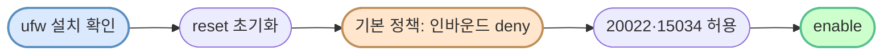
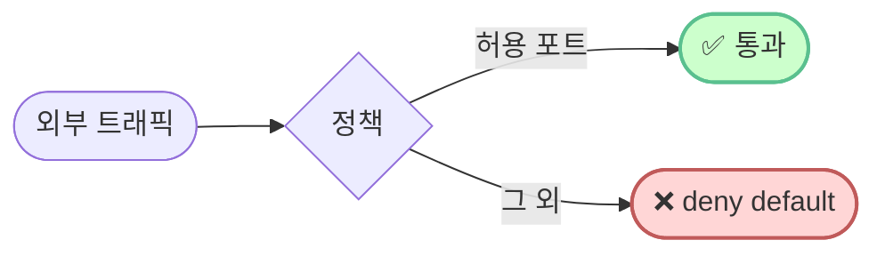

# `setup/02-firewall.sh` — 줄별·문법 풀이

> **한 줄로** · ufw 패키지 확인·설치 → reset → default 정책 → 20022·15034 허용 → enable. 모두 멱등.
>
> **코드**: [setup/02-firewall.sh](../../setup/02-firewall.sh)
> **관련 학습 노트**: [firewall-ufw-vs-firewalld](https://github.com/codewhite7777/codyssey_notes/blob/main/codyssey_b1_1_study/firewall-ufw-vs-firewalld.md), [ports-and-listening](https://github.com/codewhite7777/codyssey_notes/blob/main/codyssey_b1_1_study/ports-and-listening.md)

## 🌳 전체 흐름



---

## `ufw` 명령 자체

**U**ncomplicated **F**ire**W**all — Ubuntu/Debian 의 사용자 친화 방화벽 도구. 내부적으로 **iptables/nftables** 를 조작하지만 사람이 다루기 쉬운 명령을 제공.

```
# 복잡 (iptables 직접):
iptables -A INPUT -p tcp --dport 20022 -j ACCEPT

# 단순 (ufw):
ufw allow 20022/tcp
```

회사 비유: 회사 정문 안내 데스크에 "**20022호와 15034호만 들여보내**" 라고 한 줄로 알려주는 셈.

---

## 섹션 1 — ufw 패키지 보장

```bash
if ! command -v ufw >/dev/null 2>&1; then
    echo "[INFO] ufw 설치 중..."
    sudo apt-get update -qq
    sudo apt-get install -y ufw
fi
```

### `command -v X` 명령 존재 검사

| 부분 | 의미 |
|---|---|
| `command -v` | PATH 에서 명령 찾기, 있으면 경로 출력 + exit 0, 없으면 exit 1 |
| `ufw` | 찾을 명령 |

`command -v` 는 `which` 보다 표준이고 빠름 (bash 내장).

### `>/dev/null 2>&1` — 출력 모두 버림

| 부분 | 의미 |
|---|---|
| `>/dev/null` | stdout 을 /dev/null (블랙홀) 로 |
| `2>&1` | stderr (2번) 를 stdout (1번) 으로 합침 |
| 결과 | stdout·stderr 모두 버림 — 명령의 exit code 만 활용 |

### `if ! cmd` 구조

`!` 가 exit code 를 반전 — "`cmd` 가 실패하면" 의 의미. 즉 ufw 가 **없으면** then 블록 실행.

### `apt-get` 설치 패턴

| 부분 | 의미 |
|---|---|
| `sudo apt-get update` | 패키지 목록 갱신 |
| `-qq` | **q**uiet 두 번 — 거의 silent (출력 최소) |
| `apt-get install -y` | **y**es — Y/n confirm 자동 yes |
| `ufw` | 설치할 패키지 |

→ **자동화 친화** — 사람 개입 없이 통과.

---

## 섹션 2 — 멱등 초기화

```bash
sudo ufw --force reset
```

### `--force` 옵션

ufw 는 위험한 명령(reset, enable, delete)에 "Y/n" confirm 프롬프트를 띄움. **`--force` 가 자동 yes** — 스크립트 자동화 친화.

### `reset` 동작

모든 기존 룰을 **백업 후 삭제** + 정책을 default 로:
```
Backing up 'user.rules' to '/etc/ufw/user.rules.20260514_145422'
Backing up 'before.rules' to ...
```

### 왜 reset 이 멱등 패턴인가?

```
첫 실행 :  빈 상태 → reset → 빈 상태 + 백업 1개
두 번째 :  설정된 상태 → reset → 빈 상태 + 백업 2개
세 번째 :  설정된 상태 → reset → 빈 상태 + 백업 3개
```

**어떤 상태에서 시작해도 reset 후 빈 상태** → 멱등. 이어서 정책·룰을 새로 적용하면 항상 같은 최종 상태.

> [!NOTE]
> 백업 파일이 쌓이지만 사이즈 작아 큰 문제 X. 운영 시 주기적 정리 가능.

---

## 섹션 3 — 기본 정책

```bash
sudo ufw default deny incoming
sudo ufw default allow outgoing
```

### 정책의 의미

| 방향 | 의미 | 정책 |
|---|---|---|
| `incoming` | **들어오는** 외부 트래픽 (외부 → 내 머신) | `deny` 명시 허용된 포트만 통과 |
| `outgoing` | **나가는** 내 머신 트래픽 (내 머신 → 외부) | `allow` 자유롭게 (apt, dns 등) |

### "default deny + 명시 allow" = 화이트리스트 원칙



블랙리스트 ("나쁜 것만 막기") 보다 화이트리스트 ("좋은 것만 허용") 가 안전 — 신규 위협에 자동 대응.

---

## 섹션 4 — 필요한 포트만 허용

```bash
sudo ufw allow 20022/tcp comment 'SSH'
sudo ufw allow 15034/tcp comment 'agent-app'
```

### `allow PORT/PROTOCOL` 문법

| 부분 | 의미 |
|---|---|
| `allow` | 통과 허용 |
| `20022` | 포트 번호 |
| `/tcp` | 프로토콜 (또는 `/udp`) |
| `comment '...'` | 룰에 한 줄 설명 (`ufw status` 에 함께 표시) |

### 왜 comment 추가?

```
20022/tcp                  ALLOW IN    Anywhere                   # SSH
15034/tcp                  ALLOW IN    Anywhere                   # agent-app
```

`# SSH`, `# agent-app` 코멘트가 status 출력에 보임 → **6개월 후 봤을 때도 의도 명확** + 감사 용도.

### 두 포트의 의도

| 포트 | 용도 |
|---|---|
| **20022/tcp** | SSH (명세에서 22 → 20022 로 변경한 새 포트) |
| **15034/tcp** | agent-app 서비스 (명세 지정) |

→ 이 둘 외 모든 인바운드는 deny.

---

## 섹션 5 — 활성화

```bash
sudo ufw --force enable
```

### `enable` 동작

- 정의된 룰들을 **실제로 활성화** (이전까지는 룰 등록만, 적용 X)
- iptables/nftables 에 룰 입력
- 시스템 부팅 시 자동 시작 등록

### `--force` 가 필요한 이유

`enable` 명령은 보통 다음 confirm 을 요구:
```
Command may disrupt existing ssh connections. Proceed with operation (y|n)?
```

`--force` 가 자동 yes — 스크립트 자동화 위해 필수.

> [!WARNING]
> SSH 로 원격 접속 중에 ufw enable 시 **SSH 룰이 미리 허용되어 있어야** 끊기지 않음.
> 우리 스크립트는 섹션 4 에서 20022/tcp 허용 후 섹션 5 에서 enable → 안전.

---

## 검증

```bash
echo "[검증] ufw status verbose"
sudo ufw status verbose
```

### `status verbose` 출력 예

```
Status: active
Logging: on (low)
Default: deny (incoming), allow (outgoing), deny (routed)
New profiles: skip

To                         Action      From
--                         ------      ----
20022/tcp                  ALLOW IN    Anywhere                   # SSH
15034/tcp                  ALLOW IN    Anywhere                   # agent-app
20022/tcp (v6)             ALLOW IN    Anywhere (v6)              # SSH
15034/tcp (v6)             ALLOW IN    Anywhere (v6)              # agent-app
```

| 필드 | 의미 |
|---|---|
| `Status: active` | 방화벽 활성화 |
| `Default: ...` | 기본 정책 (deny incoming, allow outgoing) |
| `To` | 대상 (포트/프로토콜) |
| `Action` | ALLOW / DENY |
| `From` | 출발지 (Anywhere = 모든 IP) |
| `(v6)` | IPv6 룰 (ufw 가 자동 추가) |

---

## 🏢 종합 회사 비유

| 단계 | 비유 |
|---|---|
| 1. 패키지 확인 | 안내 데스크 직원이 있는지 확인, 없으면 채용 |
| 2. reset | 기존 출입 명단 모두 삭제 (백업 후) |
| 3. default 정책 | 기본: "외부 손님 출입 거부, 직원 외출 자유" |
| 4. allow 포트 | "20022호·15034호 손님만 들여보내" |
| 5. enable | 안내 데스크 정식 운영 시작 |
| 검증 | "안내 정책 어떻게 되어 있나?" 확인 |

---

## 🧪 자주 만나는 함정

| 함정 | 원인·해결 |
|---|---|
| `ufw: command not found` | minimal 이미지 — 섹션 1 의 설치 단계가 처리 |
| ufw enable 후 SSH 끊김 | SSH 포트(20022) 룰을 enable **전에** 등록 안 함 — 우리는 순서 OK |
| Docker 컨테이너 안 ufw 충돌 | 컨테이너는 호스트 iptables 공유 → 우회·간섭 가능 (이래서 VM 권장) |
| 매번 `Y/n` 프롬프트 | `--force` 누락 |
| IPv6 룰 누락 | ufw 가 자동 추가 (`/etc/default/ufw` 에 `IPV6=yes` 기본) |

---

## 🎯 한 줄 정리

> **reset(멱등 초기화) → default deny incoming → 필요 포트만 명시 allow → enable.** 화이트리스트 원칙으로 표적 면적 최소화.
