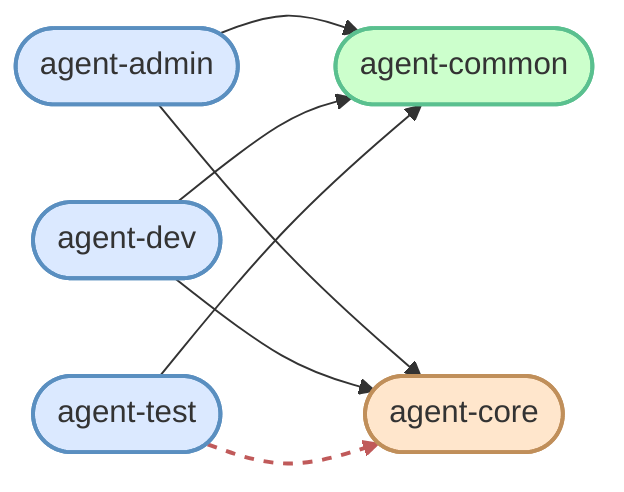

# `setup/03-users-groups.sh` — 줄별·문법 풀이

> **한 줄로** · 그룹 2개(common·core) + 사용자 3명(admin·dev·test) 생성 + 멤버십 차등 할당. test 만 core 제외 (역할 분리).
>
> **코드**: [setup/03-users-groups.sh](../../setup/03-users-groups.sh)
> **관련 학습 노트**: [users-and-groups](https://github.com/codewhite7777/codyssey_notes/blob/main/codyssey_b1_1_study/users-and-groups.md), [posix-acl](https://github.com/codewhite7777/codyssey_notes/blob/main/codyssey_b1_1_study/posix-acl.md)

## 🌳 전체 흐름


## 역할 분리 모델



→ **빨간 점선 = agent-test 의 agent-core 접근 차단** (명세 요구).

| 사용자 | common | core | 의미 |
|---|---|---|---|
| agent-admin | ✅ | ✅ | 운영 관리자 — 모든 자원 |
| agent-dev | ✅ | ✅ | 개발자 — 코드·민감 자원 |
| **agent-test** | ✅ | **❌** | 외부 테스터 — 공용 자원만 |

---

## 섹션 1 — 그룹 생성 (멱등 패턴)

```bash
for group in agent-common agent-core; do
    if getent group "$group" >/dev/null 2>&1; then
        echo "[SKIP] group $group 이미 존재"
    else
        sudo groupadd "$group"
        echo "[OK] group $group 생성"
    fi
done
```

### `for x in A B C; do ... done` 구조

bash 의 리스트 순회. 변수 `$group` 이 각 값으로 순차 설정.

| 부분 | 의미 |
|---|---|
| `for group in agent-common agent-core` | `$group` 이 두 값 순회 |
| `do` | 반복 본문 시작 |
| `done` | 반복 본문 끝 |

### `getent group "$group"` — 그룹 존재 검사

| 부분 | 의미 |
|---|---|
| `getent` | NSS (Name Service Switch) 조회 — /etc/group, LDAP, NIS 등 통합 |
| `group` | 그룹 데이터베이스 |
| `"$group"` | 검색할 그룹 이름 |

| 결과 | exit code |
|---|---|
| 그룹 있음 | 0 (성공) |
| 그룹 없음 | 2 (없음) |

### `>/dev/null 2>&1`

`getent` 가 그룹 정보를 stdout 출력 — 필요 없으니 버림. stderr 도 같이 버림(있을 일 거의 X).

### `groupadd` 명령

```bash
sudo groupadd agent-core
```

새 그룹 생성. `/etc/group` 에 한 줄 추가:
```
agent-core:x:1001:
```
- 이름:패스워드(x=섀도):GID:멤버목록

### 왜 if 로 분기?

`groupadd` 는 **이미 존재하는 그룹** 에 실행 시 에러 + exit 9 → `set -e` 발동 → 스크립트 중단. `if getent` 로 미리 확인 → **멱등 보장**.

---

## 섹션 2 — 사용자 생성 (멱등 패턴)

```bash
for user in agent-admin agent-dev agent-test; do
    if id "$user" >/dev/null 2>&1; then
        echo "[SKIP] user $user 이미 존재"
    else
        sudo useradd -m -s /bin/bash "$user"
        echo "[OK] user $user 생성"
    fi
done
```

### `id "$user"` — 사용자 존재 검사

```
$ id agent-admin
uid=1000(agent-admin) gid=1002(agent-admin) groups=1002(agent-admin)
```

사용자 정보 출력. **없으면 exit 1** + 에러 메시지 → getent 와 동일 패턴으로 분기.

### `useradd` 옵션 분해

```bash
sudo useradd -m -s /bin/bash agent-admin
```

| 옵션 | 의미 | 없으면? |
|---|---|---|
| `-m` | **m**ake home — `/home/agent-admin` 디렉토리 생성 | 홈 없어서 SSH 로그인 시 cd 실패 |
| `-s /bin/bash` | login **s**hell 지정 | 기본은 `/bin/sh` (또는 `/sbin/nologin`) |
| `agent-admin` | 사용자명 | — |

### `useradd` 가 자동으로 하는 것

- `/etc/passwd` 에 한 줄 추가
- `/etc/shadow` 에 한 줄 추가 (잠긴 상태)
- `/etc/group` 에 같은 이름의 1차 그룹 자동 생성 (예: agent-admin:x:1002:)
- `-m` 있으면 홈 디렉토리 + `.bashrc`·`.profile` 기본 파일 복사 (`/etc/skel/*` 에서)

---

## 섹션 3 — 그룹 멤버십 할당 (★ 핵심)

```bash
sudo usermod -aG agent-common,agent-core agent-admin
sudo usermod -aG agent-common,agent-core agent-dev
sudo usermod -aG agent-common              agent-test
```

### `usermod -aG GROUPS USER` 문법

| 옵션 | 의미 | 미사용 시 위험 |
|---|---|---|
| `-a` | **a**ppend (누적 추가) | **없으면 기존 보조 그룹 모두 제거** (위험) |
| `-G` | secondary **G**roups (보조 그룹들) | 1차 그룹은 그대로 |
| `g1,g2,...` | 콤마 구분 그룹 리스트 | 공백 X |
| USER | 대상 사용자 | — |

### `-aG` 가 멱등 패턴인 이유

```bash
# 첫 실행 (admin 그룹: agent-admin 만)
usermod -aG agent-common,agent-core agent-admin
# 결과: agent-admin, agent-common, agent-core

# 두 번째 실행 (이미 있는 그룹 추가)
usermod -aG agent-common,agent-core agent-admin
# 결과: agent-admin, agent-common, agent-core (변화 X)
```

`-a` 가 누적 추가라 이미 그룹원이어도 안전.

### `-a` 누락 위험 (★ 절대 하지 말 것)

```bash
# 위험: -a 없이 -G 만
usermod -G agent-common agent-admin
# 결과: agent-admin 의 보조 그룹이 [agent-common] 으로 *교체* — 기존 그룹 모두 사라짐
```

운영에서 사용자가 갑자기 sudo 권한 잃거나 다른 자원 접근 못 하는 사고 발생.

→ **항상 `-aG` 사용** 이 표준.

### test 의 그룹 차이 (★ 명세 핵심)

```bash
sudo usermod -aG agent-common              agent-test
# core 없음 ↑
```

agent-test 만 agent-core 제외 — 명세 요구. 이게 [4] 디렉토리 권한 단계의 `agent-test EACCES 차단` 검증과 연결.

---

## 검증

```bash
for u in agent-admin agent-dev agent-test; do
    id "$u"
done

for g in agent-common agent-core; do
    echo "  $g: $(getent group "$g" | cut -d: -f4)"
done
```

### `id USER` — 사용자 정보 확인

```
uid=1000(agent-admin) gid=1002(agent-admin) groups=1002(agent-admin),1000(agent-common),1001(agent-core)
```

| 필드 | 의미 |
|---|---|
| `uid=` | User ID (숫자) |
| `gid=` | 1차 그룹 ID |
| `groups=` | 모든 그룹 (1차 + 보조) |

→ test 의 groups 에 `agent-core` 가 없어야 명세 충족.

### `getent group "$g" | cut -d: -f4`

`/etc/group` 형식:
```
agent-core:x:1001:agent-admin,agent-dev
```

`:` 로 4개 필드:
1. 이름
2. 패스워드 (x=섀도)
3. GID
4. **멤버 목록** (콤마 구분)

### `cut -d: -f4` 분해

| 옵션 | 의미 |
|---|---|
| `cut` | 줄을 잘라 일부 필드만 |
| `-d:` | **d**elimiter (구분자) = `:` |
| `-f4` | **f**ield 4번째 |

→ 그룹의 멤버 목록만 추출.

---

## 🏢 종합 회사 비유

| 단계 | 비유 |
|---|---|
| 그룹 생성 | 회사에 **두 개의 부서** 신설 (공용·민감) |
| 사용자 생성 | **3명 직원 채용** (관리자·개발자·테스터) |
| 멤버십 할당 | 직원별 **부서 배치** — 테스터만 민감 부서 제외 |
| 검증 | 인사 카드 확인 — "각자 어느 부서?" |

명세의 역할 분리(Separation of Duties) 핵심 — **테스터가 API 키·로그에 접근 못 하도록** 부서 차등 설계.

---

## 🧪 자주 만나는 함정

| 함정 | 원인·해결 |
|---|---|
| `usermod: group 'X' does not exist` | 섹션 1에서 그룹 생성 후 섹션 3 에서 사용 — 순서 의존 |
| `useradd: user 'X' already exists` | -e 발동 → 우리 if 분기로 회피 |
| **`-a` 누락** | 기존 그룹이 모두 사라지는 재앙. 항상 `-aG` |
| 1차 그룹과 보조 그룹 혼동 | `id` 출력의 `gid=` 가 1차, `groups=` 가 모든 그룹 |
| 그룹 변경 후 즉시 적용 X | 사용자 재로그인 필요 (`newgrp` 으로 즉시 적용 가능) |
| `cut -f` 가 공백 분리 안 됨 | `cut` 의 기본 구분자는 **탭** — `-d` 로 명시 필수 |

---

## 🎯 한 줄 정리

> **그룹 → 사용자 → 멤버십 3단계**, 모두 `getent` / `id` 로 존재 검사 후 분기해 멱등. `usermod -aG` 의 `-a` 가 기존 그룹 보존의 핵심.
