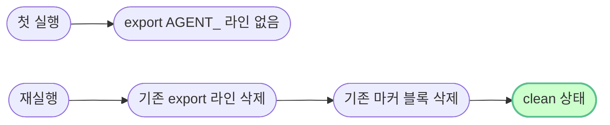

# `setup/05-environment.sh` — 줄별·문법 풀이

> **한 줄로** · API 키 파일 생성·권한 (0440) + agent-admin 의 `.bash_profile` 에 AGENT_* 환경 변수 5개 영구 등록. 멱등.
>
> **코드**: [setup/05-environment.sh](../../setup/05-environment.sh)
> **관련 학습 노트**: [shell-environment](https://github.com/codewhite7777/codyssey_notes/blob/main/codyssey_b1_1_study/shell-environment.md), [cron-environment-gotchas](https://github.com/codewhite7777/codyssey_notes/blob/main/codyssey_b1_1_study/cron-environment-gotchas.md)

## 🌳 전체 흐름


---

## 변수 정의

```bash
AGENT_HOME="/home/agent-admin/agent-app"
KEY_FILE="$AGENT_HOME/api_keys/t_secret.key"
BASH_PROFILE="/home/agent-admin/.bash_profile"
```

`KEY_FILE` 이 `$AGENT_HOME` 을 **확장(expand)** — 큰따옴표 안의 `$VAR` 는 그 값으로 치환:
```bash
KEY_FILE="/home/agent-admin/agent-app/api_keys/t_secret.key"
```

작은따옴표 `'...$VAR...'` 였다면 치환 안 됨 (그대로 문자열).

---

## 섹션 1 — 키 파일 생성 (멱등)

```bash
if [ ! -f "$KEY_FILE" ]; then
    echo "agent_api_key_test" | sudo tee "$KEY_FILE" >/dev/null
    echo "[OK] 키 파일 생성: $KEY_FILE"
else
    echo "[SKIP] 키 파일 이미 존재: $KEY_FILE"
fi

sudo chown agent-admin:agent-core "$KEY_FILE"
sudo chmod 440 "$KEY_FILE"
```

### `[ ! -f "$KEY_FILE" ]` 조건 검사

| 부분 | 의미 |
|---|---|
| `[` | bash 의 test 명령 (`[` 와 `]` 사이가 조건) |
| `!` | **부정** — 다음 조건의 반대 |
| `-f FILE` | FILE 이 일반 파일로 존재하는지 |
| `]` | test 명령 끝 (반드시 공백) |

→ "FILE 이 **없으면** then 블록 실행".

### `[ -f X ]` vs `[ -e X ]` vs `[ -d X ]`

| 옵션 | 의미 |
|---|---|
| `-f` | 일반 파일 (디렉토리·심볼릭 링크 X) |
| `-d` | 디렉토리 |
| `-e` | 어떤 종류든 존재 |
| `-r` | 읽기 가능 |
| `-w` | 쓰기 가능 |
| `-x` | 실행 가능 |
| `-z STR` | STR 이 빈 문자열 |
| `-n STR` | STR 이 비어있지 않음 |

### `echo "..." | sudo tee FILE >/dev/null` 패턴

```bash
echo "agent_api_key_test" | sudo tee "$KEY_FILE" >/dev/null
```

| 부분 | 의미 |
|---|---|
| `echo "..."` | 문자열을 stdout 으로 |
| `\|` | 파이프 — echo stdout 을 tee stdin 으로 |
| `sudo tee FILE` | FILE 에 stdin 내용 쓰기 + stdout 도 그대로 출력 |
| `>/dev/null` | tee 의 stdout 은 화면 안 보이게 |

### 왜 `> FILE` 아닌 `tee FILE`?

```bash
# ❌ 안 됨
sudo echo "text" > /etc/file
# 이유: echo 만 sudo, > redirect 는 호출자(non-root) 권한
# /etc/ 에 쓰기 권한 없으면 실패
```

```bash
# ✅ 됨
echo "text" | sudo tee /etc/file >/dev/null
# 이유: tee 자체가 sudo 로 실행 → 파일 쓰기에 root 권한
```

**redirect (`>`) 와 sudo 의 권한 분리 함정** — 운영 자동화의 표준 함정. tee 가 정석.

### 권한 `440` 의 의미

```
4  4  0
│  │  └─ 그 외: 없음
│  └──── 그룹: r--
└─────── 소유자: r--
```

= `r--r-----` — **소유자·그룹 read 만, write·execute 모두 차단**.

### 왜 write 도 차단?

- 키 파일은 **읽기 전용** — 실수로 덮어쓰기 방지
- API 키 변경은 의도적 작업이라 권한 변경 후 진행해야 함
- 무결성 보호

---

## 섹션 2 — `.bash_profile` 정화 (★ 멱등 핵심)

```bash
sudo touch "$BASH_PROFILE"
sudo sed -i '/^export AGENT_/d' "$BASH_PROFILE"
sudo sed -i '/^# --- agent-app env ---/,/^# --- end agent-app env ---/d' "$BASH_PROFILE"
```

### `touch FILE` — 없으면 빈 파일, 있으면 mtime 갱신

| 부분 | 의미 |
|---|---|
| `touch` | 파일 access·modify 시각 갱신 |
| FILE 이 없으면 | **빈 파일 생성** |
| FILE 이 있으면 | 시각만 갱신 (내용 그대로) |

→ 다음 sed 가 안전하게 동작하도록 파일 존재 보장.

### `sed -i '/PATTERN/d' FILE` — 매칭 줄 삭제

| 부분 | 의미 |
|---|---|
| `-i` | in-place (파일 자체 수정) |
| `'/PATTERN/d'` | PATTERN 매칭 줄 **d**elete |

### 첫 sed: 기존 `export AGENT_` 라인 모두 삭제

```bash
sudo sed -i '/^export AGENT_/d' "$BASH_PROFILE"
```

정규식 `^export AGENT_`:
- `^` 줄 시작
- `export AGENT_` 글자 그대로

→ 옛 AGENT_ 환경 변수 라인 흔적 제거.

### 둘째 sed: 마커 블록 삭제

```bash
sudo sed -i '/^# --- agent-app env ---/,/^# --- end agent-app env ---/d' "$BASH_PROFILE"
```

### `'/A/,/B/d'` — **범위 삭제** (★ 강력)

| 부분 | 의미 |
|---|---|
| `/A/` | 시작 패턴 매칭 줄 |
| `,` | 범위 시작·끝 구분 |
| `/B/` | 끝 패턴 매칭 줄 |
| `d` | 그 범위 삭제 |

→ `# --- agent-app env ---` 부터 `# --- end agent-app env ---` 까지 한 블록 통째로 삭제.

### 왜 두 단계 정화?



여러 번 실행해도 **중복 라인 누적 안 됨** → 멱등.

---

## 섹션 3 — 환경 변수 등록 (heredoc)

```bash
sudo tee -a "$BASH_PROFILE" >/dev/null <<'EOF'

# --- agent-app env ---
export AGENT_HOME="/home/agent-admin/agent-app"
export AGENT_PORT="15034"
export AGENT_UPLOAD_DIR="$AGENT_HOME/upload_files"
export AGENT_KEY_PATH="$AGENT_HOME/api_keys/t_secret.key"
export AGENT_LOG_DIR="/var/log/agent-app"
[ -f ~/.bashrc ] && . ~/.bashrc
# --- end agent-app env ---
EOF
```

### `tee -a` — append 모드

| 옵션 | 의미 |
|---|---|
| `-a` | **a**ppend — 덮어쓰지 않고 끝에 추가 |

### Heredoc `<<'EOF' ... EOF`

bash 의 멀티라인 입력 문법:
```bash
cmd <<DELIMITER
첫 줄
둘 줄
DELIMITER
```

`DELIMITER` 사이의 모든 내용이 `cmd` 의 stdin 으로.

### `<<'EOF'` 와 `<<EOF` 차이 (★ 중요)

| 형식 | 변수 expansion |
|---|---|
| `<<EOF` (따옴표 없음) | `$VAR`, `$(cmd)`, `\` 모두 **expand** |
| `<<'EOF'` (작은따옴표) | **그대로** 보존 (literal) |

```bash
# 따옴표 없음 — $HOME 가 expand
cat <<EOF
$HOME
EOF
# 출력: /home/user

# 작은따옴표 — $HOME 그대로
cat <<'EOF'
$HOME
EOF
# 출력: $HOME
```

### 왜 우리는 `<<'EOF'` (작은따옴표)?

```bash
export AGENT_UPLOAD_DIR="$AGENT_HOME/upload_files"
```

여기서 `$AGENT_HOME` 이 **지금 setup 스크립트 안에서 expand 되면 안 됨** — `.bash_profile` 에는 글자 그대로 `$AGENT_HOME` 이 적혀 있어야 함:
- 그래야 agent-admin 이 SSH 로 로그인할 때 그 셸이 expand
- 우리 setup 시점이 아니라 사용 시점에 expand

→ `<<'EOF'` 로 변수를 **그대로 기록**.

### `[ -f ~/.bashrc ] && . ~/.bashrc` 패턴

```bash
[ -f ~/.bashrc ] && . ~/.bashrc
```

| 부분 | 의미 |
|---|---|
| `[ -f ~/.bashrc ]` | `.bashrc` 가 있는지 |
| `&&` | 앞이 성공이면 다음 실행 |
| `. ~/.bashrc` | `.bashrc` 를 현재 셸에 source (실행, 환경 변수 set) |

→ login 셸에서 `.bash_profile` 만 source되니, `.bashrc` 도 함께 읽도록 보장. interactive 셸 일관성.

`source X` 와 `. X` 는 같은 의미. `.` (dot) 가 POSIX 표준, `source` 는 bash 확장.

---

## 검증

```bash
sudo -u agent-admin bash -lc 'env | grep ^AGENT_'
sudo -u agent-admin cat "$KEY_FILE"
ls -l "$KEY_FILE"
```

### `sudo -u agent-admin bash -lc 'cmd'` — login 셸 시뮬레이션

| 부분 | 의미 |
|---|---|
| `sudo -u agent-admin` | agent-admin 권한 |
| `bash` | bash 실행 |
| `-l` | **l**ogin 셸 — `.bash_profile` 자동 source |
| `-c 'cmd'` | 명령 실행 후 종료 |

→ "agent-admin 이 SSH 로 막 로그인한 상태" 시뮬레이션.

### `env | grep ^AGENT_`

`env` = 현재 환경 변수 모두 출력. `grep ^AGENT_` = AGENT_ 로 시작하는 줄만.

기대:
```
AGENT_HOME=/home/agent-admin/agent-app
AGENT_PORT=15034
AGENT_UPLOAD_DIR=/home/agent-admin/agent-app/upload_files
...
```

---

## 🏢 종합 회사 비유

| 단계 | 비유 |
|---|---|
| 키 파일 | **금고실(api_keys)에 비밀 출입 카드** 한 장 — read-only 봉인 |
| .bash_profile 정화 | **신입사원 안내문** 의 옛 메모 지우기 |
| 환경 변수 등록 | 새 안내문에 "**부서 위치·도구 위치**" 정확히 표기 |
| 검증 | "**입사 첫날 진짜 안내문이 작동하나**" 시뮬레이션 |

명세의 핵심 — agent-admin 이 SSH 접속 시 `.bash_profile` 자동 source → AGENT_* 즉시 사용 가능.

---

## 🧪 자주 만나는 함정

| 함정 | 원인·해결 |
|---|---|
| `sudo echo "..." > FILE` 실패 | redirect 가 호출자 권한 — `echo \| sudo tee FILE` 패턴 |
| .bash_profile 중복 라인 누적 | 정화 단계 누락 — 첫 sed 가 그래서 있음 |
| `cat <<EOF` 안에 `$VAR` 가 expand 되어 망함 | `<<'EOF'` (작은따옴표) 사용 |
| cron 에서 AGENT_ 안 보임 | cron 은 `.bash_profile` 안 읽음 — monitor.sh 가 default 처리로 회피 |
| 키 파일 권한 600 | 444 / 440 → 그룹 read 까지 허용 (멤버 사용 가능) |
| AGENT_HOME 이 setup 시점에 expand 됨 | `<<EOF` (따옴표 없음) 사용한 함정 — `<<'EOF'` 로 |

---

## 🎯 한 줄 정리

> **키 파일 생성 + .bash_profile 마커 블록 멱등 갱신** — heredoc `<<'EOF'` 의 작은따옴표가 변수 보존의 핵심. tee 패턴이 sudo redirect 함정 회피.
