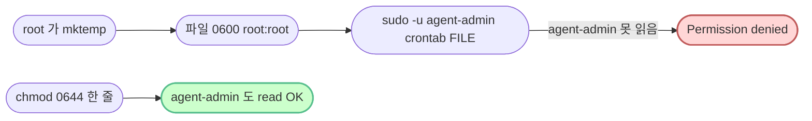

# `setup/06-cron.sh` — 줄별·문법 풀이

> **한 줄로** · logrotate 정책 (10MB/10파일) 설치 + agent-admin 의 crontab 에 monitor.sh 매분 실행 등록. 멱등.
>
> **코드**: [setup/06-cron.sh](../../setup/06-cron.sh)
> **관련 학습 노트**: [cron-fundamentals](https://github.com/codewhite7777/codyssey_notes/blob/main/codyssey_b1_1_study/cron-fundamentals.md), [log-rotation](https://github.com/codewhite7777/codyssey_notes/blob/main/codyssey_b1_1_study/log-rotation.md), [cron-environment-gotchas](https://github.com/codewhite7777/codyssey_notes/blob/main/codyssey_b1_1_study/cron-environment-gotchas.md)

## 🌳 전체 흐름


---

## 섹션 1 — logrotate 정책 설치

```bash
sudo tee /etc/logrotate.d/agent-app >/dev/null <<'EOF'
/var/log/agent-app/monitor.log {
    su agent-dev agent-core
    size 10M
    rotate 10
    compress
    delaycompress
    missingok
    notifempty
    copytruncate
    create 0640 agent-dev agent-core
}
EOF
```

### `/etc/logrotate.d/` 디렉토리

시스템 logrotate 가 매일 (`cron.daily` 통해) 스캔하는 디렉토리. 여기에 파일 하나 넣으면 그 파일의 정책으로 자동 회전.

### logrotate 옵션 분해

| 옵션 | 의미 |
|---|---|
| `su agent-dev agent-core` | **회전 작업을 이 user/group 권한으로** (★ 보안 거부 회피) |
| `size 10M` | 파일 크기 10MB 도달 시 회전 |
| `rotate 10` | 회전된 파일 10개까지 보존 (그 이상은 가장 오래된 것 삭제) |
| `compress` | 회전된 파일 gzip 압축 |
| `delaycompress` | 가장 최근 회전 파일은 압축 안 함 (다음 회전 시 압축) |
| `missingok` | 원본 파일 없어도 에러 X (start 직후 정상) |
| `notifempty` | 빈 파일은 회전 안 함 |
| `copytruncate` | 원본 복사 후 truncate (앱 재시작 없이 가능) |
| `create 0640 user group` | 회전 후 새 로그 파일을 **0640 (owner rw + group r + others 차단)** + user:group 소유자로 생성. 0644 면 others 가 monitor.log read 가능해 정보 누출 — 0640 으로 agent-core 그룹원만 read. `.bash_profile` 의 0640 결정과 같은 원칙 (Defense in Depth) |

### `su agent-dev agent-core` 가 핵심 (회고 노트 함정 2)

`/var/log/agent-app/` 는 `2770` (group-writable). logrotate 의 기본 보안 정책:

> "그룹 쓰기 가능 디렉토리에서 회전 작업은 거부 (변조 위험)"

`su agent-dev agent-core` = "**회전 시 이 user/group 권한으로 동작**" 명시 → 보안 검사 통과.

### `copytruncate` 작동 원리


대안 (`copytruncate` 없음) — rename 방식:
- 원본 → `monitor.log.1` (rename)
- 새 빈 monitor.log 생성
- **앱이 옛 파일에 계속 씀** (fd 가 옛 파일을 가리킴) → 새 monitor.log 안 자라남

`copytruncate` 는 이 문제 회피 — 앱이 같은 fd 로 새 파일에 쓰기 계속.

---

## 섹션 2 — logrotate 문법 검증

```bash
sudo logrotate -d /etc/logrotate.d/agent-app >/dev/null 2>&1 \
    && echo "[OK] logrotate 문법 검증 통과" \
    || echo "[WARN] logrotate dry-run 경고 — 직접 실행해 확인"
```

### `logrotate -d` — dry-run

| 옵션 | 의미 |
|---|---|
| `-d` | **d**ebug/dry-run — 실제 회전 X, 검증만 |

설정 문법 OK + 권한·디렉토리 정상 → exit 0.

### `cmd1 && cmd2 || cmd3` 패턴

| 부분 | 동작 |
|---|---|
| `cmd1 && cmd2` | cmd1 성공 시 cmd2 |
| `cmd1 \|\| cmd3` | cmd1 실패 시 cmd3 |

bash 의 **삼항 연산자** 흉내:
```
condition ? success : failure   (다른 언어)
cmd && success || failure       (bash)
```

> [!WARNING]
> 함정: `cmd1 && cmd2` 가 **둘 다** 의미 — cmd2 도 실패하면 `\|\| cmd3` 가 실행됨. 우리 경우 echo 라 거의 안전.

### `\` 줄바꿈 (line continuation)

```bash
sudo logrotate ... \
    && echo "OK" \
    || echo "WARN"
```

`\` 가 줄 끝에 있으면 **다음 줄로 명령 이어짐**. 가독성 위해 긴 명령 분리.

> [!WARNING]
> `\` 뒤에 **공백 한 칸이라도 있으면** line continuation 깨짐. 학생이 이전에 실제로 만난 함정.

---

## 섹션 3 — 임시 파일 준비 + trap

```bash
TMPCRON=$(mktemp)
chmod 0644 "$TMPCRON"
trap "rm -f $TMPCRON" EXIT
```

### `mktemp` — 안전한 임시 파일

```bash
TMPCRON=$(mktemp)
# 결과 예: /tmp/tmp.kd4ZhgmBAC
```

| 특징 | 효과 |
|---|---|
| 랜덤 이름 | 다른 프로세스와 충돌 X |
| 권한 0600 | 보안 (소유자만 read·write) |
| `/tmp` 위치 | sticky bit 보호 |

### `chmod 0644 "$TMPCRON"` (★ 회고 노트 함정 1)

mktemp 기본 0600 → root 가 만든 파일을 **agent-admin 이 못 읽음**.



### `trap "rm -f $TMPCRON" EXIT` — 자동 청소

| 부분 | 의미 |
|---|---|
| `trap` | 시그널·이벤트 핸들러 등록 |
| `"..."` | 실행할 명령 |
| `EXIT` | 스크립트 종료 시 (정상·에러·시그널 모두) |

→ 스크립트가 어떻게 끝나든 임시 파일 자동 삭제. 임시 파일 누적 방지.

---

## 섹션 4 — 기존 crontab 정화

```bash
sudo -u agent-admin crontab -l 2>/dev/null \
    | grep -v 'monitor\.sh' \
    | grep -v '^SHELL=' \
    | grep -v '^PATH=' \
    | grep -v '^MAILTO=' \
    > "$TMPCRON" || true
```

### `crontab -l` — 현재 crontab 출력

| 명령 | 의미 |
|---|---|
| `crontab -l` | 사용자의 현재 crontab 라인 모두 출력 |
| `sudo -u agent-admin` | agent-admin 의 crontab 보기 |
| `2>/dev/null` | 에러 (crontab 없음 등) 버림 |

### `grep -v PATTERN` — 역매칭

| 옵션 | 의미 |
|---|---|
| `-v` | **i**nvert — PATTERN 매칭 안 한 줄만 |

4 단계 파이프:
1. monitor.sh 라인 제외
2. `SHELL=...` 제외
3. `PATH=...` 제외
4. `MAILTO=...` 제외

→ 우리가 다시 추가할 라인들만 정화.

### `> "$TMPCRON"` — redirect 로 임시 파일에

정화 결과를 임시 파일에. 다음 섹션에서 새 라인 추가 예정.

### `|| true` — 빈 crontab 대응

`crontab -l` 이 비어있으면 exit 1 → `set -e` 발동 → 스크립트 종료. `|| true` 가 회피.

---

## 섹션 5 — 새 crontab 항목 추가

```bash
cat >> "$TMPCRON" <<'EOC'
SHELL=/bin/bash
PATH=/usr/local/sbin:/usr/local/bin:/usr/sbin:/usr/bin:/sbin:/bin
MAILTO=""
* * * * * /home/agent-admin/agent-app/bin/monitor.sh >> /var/log/agent-app/cron.log 2>&1
EOC
```

### `cat >> FILE <<'EOC'` 패턴

heredoc 으로 여러 줄을 파일 끝에 추가:
- `>>` append 모드
- `<<'EOC'` 변수 expansion 없이 그대로 (cron 형식 보존)

### crontab 라인 형식

```
* * * * * COMMAND
│ │ │ │ │
│ │ │ │ └─ 요일 (0-7, 일=0 또는 7)
│ │ │ └─── 월 (1-12)
│ │ └───── 일 (1-31)
│ └─────── 시 (0-23)
└───────── 분 (0-59)
```

`* * * * *` = "**매분**". 모든 자리 `*` = "모든 값".

### cron 환경 변수 (★ cron 함정 회피)

| 변수 | 의미 |
|---|---|
| `SHELL=/bin/bash` | cron 이 명령 실행할 셸 (기본 `/bin/sh` — bash 확장 X) |
| `PATH=...` | 명령 검색 경로 (cron 기본 매우 빈약) |
| `MAILTO=""` | cron 이 출력을 메일로 안 보냄 (메일 시스템 없을 때 안전) |

### 명령 라인 분해

```
* * * * * /home/agent-admin/agent-app/bin/monitor.sh >> /var/log/agent-app/cron.log 2>&1
└───┬───┘ └──────────────┬──────────────────────┘ └──┬──┘ └──────┬───────┘ └─┬─┘
  매분      절대 경로 (PATH 의존 X)              append    cron 로그   stderr
                                                                       → stdout
```

`>>` append + `2>&1` stderr 도 stdout 으로 합쳐 cron.log 에 모두 기록.

---

## 섹션 6 — crontab 등록

```bash
sudo -u agent-admin crontab "$TMPCRON"
```

### `crontab FILE` — 파일을 새 crontab 으로

| 변형 | 의미 |
|---|---|
| `crontab FILE` | FILE 내용을 새 crontab 으로 (덮어쓰기) |
| `crontab -e` | 인터랙티브 편집 (자동화 X) |
| `crontab -l` | 현재 내용 보기 |
| `crontab -r` | 모두 삭제 |

`sudo -u agent-admin` 로 agent-admin 의 crontab 등록 (root 가 직접 등록 X).

---

## 검증

```bash
sudo -u agent-admin crontab -l
```

기대:
```
SHELL=/bin/bash
PATH=/usr/local/sbin:/usr/local/bin:/usr/sbin:/usr/bin:/sbin:/bin
MAILTO=""
* * * * * /home/agent-admin/agent-app/bin/monitor.sh >> /var/log/agent-app/cron.log 2>&1
```

---

## 🏢 종합 회사 비유

| 단계 | 비유 |
|---|---|
| logrotate 정책 | 회사의 **공책 회전 규정** ("10MB 가득 차면 새 공책, 10권까지 보관") |
| 문법 검증 | 규정 점검 |
| 임시 파일 + chmod | **메모지에 새 일정** 적기, 비서가 읽도록 |
| 기존 정화 + 새 추가 | 옛 일정 지우고 새 일정 추가 |
| crontab 등록 | 비서(cron)에게 정식 일정표 인계 |

---

## 🧪 자주 만나는 함정

| 함정 | 원인·해결 |
|---|---|
| `Permission denied` (TMPCRON) | mktemp 0600 → agent-admin 못 읽음 — chmod 0644 (회고 함정 1) |
| logrotate `insecure permissions` | log dir 2770 (group-writable) — `su` 지시어 (회고 함정 2) |
| cron 이 monitor.sh 실행 안 함 | cron 데몬 미실행 — `sudo systemctl start cron` |
| cron 환경에서 `awk: not found` | PATH 빈약 — cron 라인 `PATH=...` 명시 |
| 한국어 stderr 깨짐 | `LC_ALL=C` 명시 (monitor.sh 자체에서 처리) |
| `crontab -l` 이 `no crontab for ...` | 첫 실행 정상 — `2>/dev/null \|\| true` 로 회피 |

---

## 🎯 한 줄 정리

> **logrotate 정책 + cron 매분 등록 두 단계.** 임시 파일 권한·정화·trap·heredoc·redirect 등 운영 자동화 도구 9가지가 한 파일에 모두 등장.
