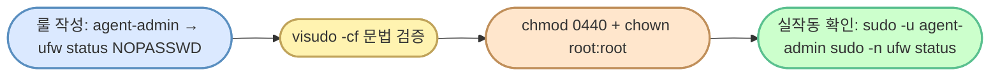

# `setup/07-sudoers.sh` — 줄별·문법 풀이

> **한 줄로** · `/etc/sudoers.d/agent-admin-monitor` 에 한 줄 룰만 작성. agent-admin 사용자가 비밀번호 없이 **`ufw status` 명령 하나만** 호출 가능하게 — monitor.sh 의 ufw 점검을 가능하게 하는 **최소 권한** 부여.
>
> **코드**: [setup/07-sudoers.sh](../../setup/07-sudoers.sh)
> **관련 학습 노트**: [sudo-and-sudoers](https://github.com/codewhite7777/codyssey_notes/blob/main/codyssey_b1_1_study/sudo-and-sudoers.md)
> **연관 정책 문서**: [sudo-policy.md](./sudo-policy.md) §"방화벽 검사"

## 🌳 전체 흐름



---

## 왜 이 스크립트가 필요한가 — 운영 사고 추적

### 발견된 증상

monitor.sh 를 수동 실행했더니 출력에 false positive:

```
[HEALTH CHECK]
Checking process 'agent-app'... [OK]
Checking port 15034...           [OK]
[WARNING] firewall (ufw) is not active   ← ★ ufw 는 active 인데?
```

`sudo ufw status` 로 직접 확인 → `Status: active`. 즉 ufw 는 켜져 있는데 monitor.sh 가 잘못 읽음.

### 근본 원인 — monitor.sh 의 호출 방식

```bash
# bin/monitor.sh:136
if sudo -n ufw status 2>/dev/null | grep -q "Status: active"; then
```

| 부분 | 의미 |
|---|---|
| `sudo -n` | **n**on-interactive — 비밀번호 prompt 없이 시도, NOPASSWD 룰 없으면 즉시 실패 |
| `2>/dev/null` | 에러 메시지 숨김 |
| `grep -q "Status: active"` | 출력에 "Status: active" 가 있으면 OK |

agent-admin 이 sudoer 가 아니므로 `sudo -n` 이 침묵하며 실패 → grep 결과 비어있음 → `Status: active` 매칭 X → else 분기 → false WARNING.

monitor.sh 작성자의 의도는 *"NOPASSWD 룰이 있으니 -n 으로 prompt 회피"* 였지만, **setup 단계에서 그 룰을 만들지 않음**. 코드 의도와 실제 권한이 어긋난 **흔한 운영 함정**.

### 해결 방향 비교

| 방안 | 무엇 | 트레이드오프 |
|---|---|---|
| **A) sudoers 룰 추가** ✅ | NOPASSWD: `/usr/sbin/ufw status` 한 줄 | `ufw status` 만 노출 — 최소 권한 유지, monitor.sh 원래 의도 보존 |
| B) `systemctl is-active ufw` 로 교체 | sudo 불필요 | systemd 활성 ≠ ufw 활성 — 엣지 케이스에서 다를 수 있음 |
| C) 검사 제거 | 가장 단순 | 명세 §"상태 점검" 위반 |

→ **A 채택**. 이 스크립트가 그 룰을 만드는 코드.

---

## 섹션 1 — 룰 작성 (멱등)

```bash
SUDOERS_FILE="/etc/sudoers.d/agent-admin-monitor"
RULE='agent-admin ALL=(ALL) NOPASSWD: /usr/sbin/ufw status'

sudo tee "$SUDOERS_FILE" >/dev/null <<EOF
# codyssey_b1_1 — monitor.sh 의 방화벽 점검 지원
# 명세: monitor.sh 가 'sudo ufw status' 로 ufw 활성 여부를 점검 (§상태 점검)
# 범위: agent-admin 사용자가 'ufw status' 명령만 비밀번호 없이 호출
$RULE
EOF
```

### sudoers 룰 문법 — `agent-admin ALL=(ALL) NOPASSWD: /usr/sbin/ufw status`

| 필드 | 의미 |
|---|---|
| `agent-admin` | 룰이 적용되는 **사용자** (또는 `%group` 으로 그룹) |
| `ALL=` | 어느 **호스트** 에서든 (멀티 머신 환경에서 한 sudoers 공유 시 의미) |
| `(ALL)` | 어느 **대상 사용자** 로든 변신 가능 (보통 root) |
| `NOPASSWD:` | 비밀번호 prompt 생략 |
| `/usr/sbin/ufw status` | 허용되는 **정확한 명령** (★ 절대 경로 + 인자까지) |

### 왜 절대 경로 (`/usr/sbin/ufw`) 인가?

`PATH` 가오염되면 가짜 `ufw` 실행 위험. 절대 경로 고정으로 *PATH 변조 공격* 차단.

```
# ❌ 위험 — 어떤 ufw 든 실행 허용
agent-admin ALL=(ALL) NOPASSWD: ufw status

# ✅ 안전 — /usr/sbin/ufw 만
agent-admin ALL=(ALL) NOPASSWD: /usr/sbin/ufw status
```

### 왜 `status` 인자까지 지정?

`/usr/sbin/ufw` 만 적으면 `ufw disable`·`ufw delete` 등 **모든** 서브명령 허용. `status` 만 명시 = **읽기 전용 명령**만 노출. 방화벽 제어는 불가.

### `tee` + 헤레닥 (HereDoc) 패턴

| 부분 | 의미 |
|---|---|
| `sudo tee FILE` | stdout 을 sudo 권한으로 파일에 기록 + 화면에도 미러 |
| `>/dev/null` | 미러를 버려 화면 조용히 |
| `<<EOF ... EOF` | 헤레닥 — 두 EOF 사이 텍스트가 stdin |

→ "내가 자료 입력하면 sudo 가 그걸 파일에 적어줘" 패턴. 멱등 (매번 덮어씀).

### 왜 별도 파일 (`/etc/sudoers.d/...`) 인가?

`/etc/sudoers` 자체를 직접 수정하면:
- 문법 실수로 **모든 sudo 사용 자체가 막힘** (락아웃)
- 다른 룰 충돌 가능

`/etc/sudoers.d/<이름>` 패턴:
- 메인 sudoers 가 `#includedir /etc/sudoers.d` 로 자동 include
- 파일 단위로 추가·삭제 가능 (modular)
- 한 파일이 망가져도 다른 파일은 영향 X

---

## 섹션 2 — 문법 검증 (★ 필수)

```bash
if ! sudo visudo -cf "$SUDOERS_FILE"; then
    echo "[FAIL] sudoers 문법 오류 — 파일 제거 후 종료"
    sudo rm -f "$SUDOERS_FILE"
    exit 1
fi
```

### `visudo -cf` — 안전 장치

| 옵션 | 의미 |
|---|---|
| `-c` | **c**heck — 문법 검증만, 편집 X |
| `-f FILE` | 검증할 파일 지정 (기본은 `/etc/sudoers`) |

검증 통과 시 출력: `/etc/sudoers.d/agent-admin-monitor: parsed OK`
실패 시 비-0 반환 + 에러 위치 출력.

### 왜 검증이 필수?

잘못된 sudoers 의 위험:
```
# 가상 예시 — 콜론 누락
agent-admin ALL=(ALL) NOPASSWD /usr/sbin/ufw status  # 잘못된 문법
```

이게 활성되면 → 시스템 sudo 자체가 망가져 모든 sudo 명령이 실패 → **root 비밀번호 모르면 복구 불능** (single-user mode 부팅 필요).

→ 검증 실패 = 파일 즉시 삭제, set -e 가 스크립트 중단. 안전한 실패.

---

## 섹션 3 — 권한 정리

```bash
sudo chown root:root "$SUDOERS_FILE"
sudo chmod 0440 "$SUDOERS_FILE"
```

### 0440 의 의미 — sudoers 표준

| 위치 | 권한 | 누가 |
|---|---|---|
| owner (root) | `r--` | 읽기만 |
| group (root) | `r--` | 읽기만 |
| others | `---` | 차단 |

### sudo 의 보안 검사

sudo 는 sudoers.d 파일을 읽기 전 **권한을 검증** — 0440 이 아니면 *"잘못된 권한"* 로 무시:

```
sudo: /etc/sudoers.d/agent-admin-monitor is world writable
sudo: no valid sudoers sources found
```

→ 0440 + root:root 조합이 **유일하게 허용**. 다른 권한이면 룰 자체가 무효.

### 왜 owner 도 write 불가 (0**4**40)?

`0640` (owner write 가능) 도 동작 가능하지만 0440 이 권장. 이유: *실수로라도 root 가 직접 수정 못 하게* → `visudo` 를 통해서만 편집 강제 (문법 검증 자동 수반).

---

## 섹션 4 — 실작동 확인 (★ 핵심 검증)

```bash
if sudo -u agent-admin sudo -n /usr/sbin/ufw status >/dev/null 2>&1; then
    echo "[OK] agent-admin 이 비밀번호 없이 'sudo ufw status' 호출 가능"
else
    echo "[FAIL] agent-admin 의 sudo -n ufw status 실패 — 룰이 활성화되지 않음"
    exit 1
fi
```

### 왜 "설정만" 보고 끝내지 않는가

파일이 존재하고 권한이 올바르더라도, **실제로 sudo 가 그 룰을 인식하고 적용하는지**는 다른 문제. monitor.sh 가 정확히 이 명령 형태 (`sudo -n /usr/sbin/ufw status`) 로 호출하므로, 그게 통과되는지 직접 시뮬레이션.

### `sudo -u agent-admin sudo -n ...` 이중 sudo

| 단계 | 의미 |
|---|---|
| `sudo -u agent-admin` | **첫째 sudo** — root 권한으로 agent-admin 으로 변신 (테스트용) |
| `sudo -n /usr/sbin/ufw status` | **둘째 sudo** — agent-admin 이 새 룰로 root 권한 호출 |

monitor.sh 실행 시: agent-admin 셸 안에서 `sudo -n ufw status` 호출 → 이게 통과되어야 정상. 위 명령은 그 상황을 정확히 재현.

### 통과 vs 실패

- **통과 (exit 0)**: 룰이 활성, monitor.sh 의 ufw 점검이 정상 동작 → `[OK]`
- **실패 (exit ≠ 0)**: 룰 누락·권한 오류·문법 오류 → `[FAIL]` + set -e 중단

이 검증이 없으면 *"파일은 만들었는데 작동은 안 함"* 의 위험 잔존. 마지막 안전 그물.

---

## 🏢 종합 회사 비유

| 단계 | 비유 |
|---|---|
| 1. 룰 작성 | 보안팀이 "agent-admin 사원은 방범 상태 *확인*만 비밀번호 없이 가능" 사규에 명시 |
| 2. visudo -cf | 사규 초안을 법무팀이 검토 — 오타·누락 검증 |
| 3. chmod 0440 | 사규집은 **읽기 전용**, 보안팀장만 수정 가능 (visudo 경유) |
| 4. 실작동 확인 | agent-admin 사원에게 실제 시켜봐서 *비밀번호 없이* 통과되는지 검증 |

→ "최소 권한, 검증된 변경, 실작동 확인" — 운영 보안의 3 박자.

---

## 🧪 자주 만나는 함정

| 함정 | 원인·해결 |
|---|---|
| `agent-admin is not in the sudoers file` | NOPASSWD 룰의 사용자명 오타 — `agent_admin` 등 |
| 룰 만들었는데 여전히 비밀번호 prompt | 권한이 0440 아님 → sudo 가 무시. `ls -l /etc/sudoers.d/<file>` 확인 |
| visudo -cf OK 인데 sudo -n 이 실패 | 명령 절대 경로 불일치 — sudoers 는 `/usr/sbin/ufw` 인데 PATH 에 `/usr/bin/ufw` 가 먼저 |
| 시스템 sudo 자체가 망가짐 | `/etc/sudoers` 직접 편집 시 문법 오류 → **반드시 `visudo` 사용** + 별도 `/etc/sudoers.d/` 권장 |
| 룰을 명령 절대경로 없이 작성 | `NOPASSWD: ufw status` 는 PATH 변조에 취약 → `/usr/sbin/ufw status` 필수 |
| 다른 머신에서 같은 룰이 동작 안 함 | ufw 경로가 배포판마다 다를 수 있음 — `which ufw` 로 확인 |

---

## 🔗 명세 매핑

| 명세 항목 | 이 스크립트의 역할 |
|---|---|
| §"상태 점검 (경고만 출력)" — 방화벽 활성 여부 점검 | monitor.sh 의 `sudo -n ufw status` 가 *정확히* 동작하게 함 — false WARNING 제거 |
| §"필요한 경우에만 sudo" (자기평가) | NOPASSWD 룰을 `ufw status` 하나로 제한 — 최소 권한 원칙 |
| §"트러블슈팅 설명 능력" (자기평가) | 발견→진단→해결 흐름이 코드 헤더와 이 문서에 기록 |

---

## 🎯 한 줄 정리

> **"monitor.sh 의 침묵하던 false WARNING 을, sudoers.d 의 한 줄 + 권한 0440 + visudo 검증 + 실작동 검증 으로 해결."** 최소 권한 + 안전한 변경 + 검증 통과의 모범 사례.
