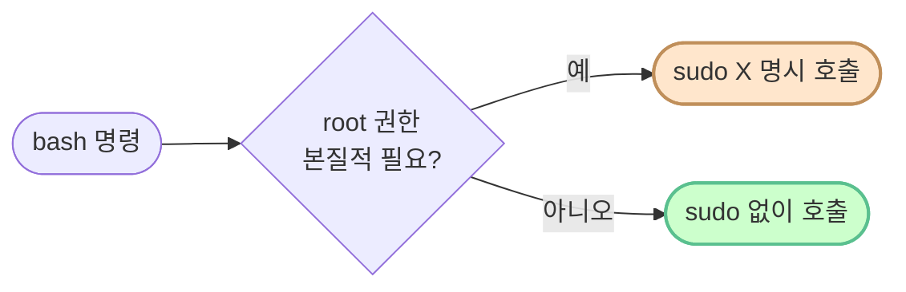

# sudo 사용 정책 — "필요한 경우에만" 충족 증거

> **한 줄로** · 명세 제약 #7-2 **"필요한 경우에만 sudo 사용 (가능한 일반 계정으로 진행)"** 의 충족 증거. 모든 sudo 호출이 본질적으로 root 권한이 필요한 8개 카테고리에 한정.
>
> **명세 원문**: "필요한 경우에만 sudo 사용(가능한 일반 계정으로 진행)"

## 🎯 핵심 원칙 — Principle of Least Privilege

각 sudo 호출이 **본질적으로 root 권한이 필요한지** 의 판정 기준:



→ 본 레포의 88건 sudo 사용 모두 8개 카테고리에 속함. 일반 명령(echo·grep·awk·변수)은 sudo 없이.

---

## 📊 사용 현황 (10개 스크립트)

| 스크립트 | sudo 호출 | 카테고리 |
|---|---|---|
| `setup/01-ssh.sh` | 11 | 시스템 파일, systemd, 검증 |
| `setup/02-firewall.sh` | 10 | apt·ufw·iptables |
| `setup/03-users-groups.sh` | 5 | 사용자·그룹 관리 |
| `setup/04-directories.sh` | 17 | 시스템 디렉토리·권한 |
| `setup/05-environment.sh` | 13 | 시스템 파일·tee 패턴 |
| `setup/06-cron.sh` | 9 | 시스템 파일·다른 사용자 |
| `setup/setup-all.sh` | 5 | install·sub 스크립트 |
| `setup/verify.sh` | 13 | 보안 자원 read |
| `bin/monitor.sh` | 5 | ufw 상태 read 등 |
| **`bin/report.sh`** | **0** | **일반 권한만** ★ |

→ **report.sh 가 sudo 0회** 인 점이 핵심 — 최소 권한 원칙의 가장 명확한 예.

---

## 1️⃣ 시스템 파일 수정

### 명령 예시
```bash
sudo sed -i 's/^#\?Port .*/Port 20022/' /etc/ssh/sshd_config
sudo tee /etc/logrotate.d/agent-app >/dev/null <<'EOF'...EOF
sudo tee -a /home/agent-admin/.bash_profile >/dev/null <<'EOF'...EOF
```

### 왜 root 필수?

| 파일 | 소유자 | 권한 | 일반 사용자 쓰기? |
|---|---|---|---|
| `/etc/ssh/sshd_config` | root | 0644 | ❌ |
| `/etc/logrotate.d/*` | root | 0644 | ❌ |
| `/home/agent-admin/.bash_profile` | agent-admin | 0644 | ❌ (다른 사용자의 홈 파일) |

→ 시스템 설정 파일은 보안상 **root 만 수정** 정책. sudo 없으면 `Permission denied`.

### 관련 워크스루
[01-ssh.md](./01-ssh.md), [05-environment.md](./05-environment.md), [06-cron.md](./06-cron.md)

---

## 2️⃣ 사용자·그룹 관리

### 명령 예시
```bash
sudo groupadd agent-core
sudo useradd -m -s /bin/bash agent-admin
sudo usermod -aG agent-common,agent-core agent-admin
```

### 왜 root 필수?

이 명령들이 건드리는 파일:
- `/etc/passwd` — 사용자 데이터베이스
- `/etc/shadow` — 비밀번호 해시 (★ 보안 매우 민감)
- `/etc/group` — 그룹 데이터베이스

→ 일반 사용자가 임의로 계정 만들 수 있으면 권한 우회 위험. **root 전용**.

회사 비유: **인사 시스템의 사번 발급은 인사부장(root) 만**.

### 관련 워크스루
[03-users-groups.md](./03-users-groups.md)

---

## 3️⃣ 시스템 디렉토리 생성

### 명령 예시
```bash
sudo mkdir -p /run/sshd
sudo mkdir -p /var/log/agent-app
sudo mkdir -p /home/agent-admin/agent-app
```

### 왜 root 필수?

| 경로 | 소유자 | 일반 사용자 쓰기? |
|---|---|---|
| `/run/*` | root | ❌ |
| `/var/log/*` | root | ❌ |
| `/home/agent-admin/*` | agent-admin | ❌ (다른 사용자의 홈) |

→ 부모 디렉토리가 root 또는 다른 사용자 소유 → 그 안에 만들려면 적절한 권한 필요.

### 관련 워크스루
[01-ssh.md](./01-ssh.md) (`/run/sshd`), [04-directories.md](./04-directories.md)

---

## 4️⃣ 소유자·권한 변경

### 명령 예시
```bash
sudo chown agent-admin:agent-core "$AGENT_HOME"
sudo chmod 2770 "$LOG_DIR"
sudo install -m 750 -o agent-dev -g agent-core ...
```

### 왜 root 필수?

| 명령 | 일반 사용자 가능? |
|---|---|
| `chown USER FILE` | ❌ **root 전용** (POSIX 보안 안전장치) |
| `chmod FILE` (자기 소유) | ✅ |
| `chmod FILE` (다른 사용자 소유) | ❌ |
| `install -o USER -g GROUP` | ❌ (다른 사용자 지정) |

### chown 이 root 전용인 이유

일반 사용자가 자기 파일을 다른 사용자에게 넘길 수 있으면:
- **권한 추적 깨짐** (감사 로그 우회)
- **위조된 파일** 떠넘기는 공격 가능
- POSIX 표준상 chown 은 root 전용

### 관련 워크스루
[04-directories.md](./04-directories.md), [setup-all.md](./setup-all.md)

---

## 5️⃣ 방화벽·iptables 조작

### 명령 예시
```bash
sudo apt-get install -y ufw
sudo ufw default deny incoming
sudo ufw allow 20022/tcp
sudo ufw --force enable
```

### 왜 root 필수?

- ufw 는 내부적으로 **iptables/nftables** 조작
- iptables 는 **커널 레이어 패킷 필터** → root + `CAP_NET_ADMIN` 권한 필수
- 일반 사용자가 방화벽 변경하면 시스템 보안 무력화 위험

→ Linux 의 핵심 보안 원칙: **네트워크 정책은 root 만**.

### 관련 워크스루
[02-firewall.md](./02-firewall.md)

---

## 6️⃣ systemd·데몬 제어

### 명령 예시
```bash
sudo systemctl enable ssh
sudo systemctl restart ssh
```

### 왜 root 필수?

- systemd 는 **PID 1 init 시스템** — 모든 시스템 서비스 관리
- 데몬 시작·정지·재시작은 시스템 전체에 영향
- 일반 사용자가 sshd 재시작하면 **다른 사용자 SSH 세션 모두 끊김** → 보안 위험

→ systemctl 의 시스템 서비스 명령은 root 전용 (또는 polkit 정책 필요).

### 관련 워크스루
[01-ssh.md](./01-ssh.md)

---

## 7️⃣ 다른 사용자 권한으로 실행

### 명령 예시
```bash
sudo -u agent-admin crontab "$TMPCRON"
sudo -u agent-admin bash -lc 'env | grep ^AGENT_'
sudo -u agent-test ls "$AGENT_HOME/api_keys"
```

### 왜 root 필수?

`sudo -u OTHER_USER cmd` = "다른 사용자 권한으로 cmd 실행"  
→ 본질적으로 **신원 변경(impersonation)** → root 만 가능.

### 활용

| 명령 | 용도 |
|---|---|
| `sudo -u agent-admin crontab` | agent-admin 의 crontab 등록 |
| `sudo -u agent-admin bash -lc` | agent-admin 의 login 셸 시뮬레이션 (.bash_profile 검증) |
| `sudo -u agent-test ls` | **agent-test 가 차단되는지 검증** (반례 검사) |

회사 비유: **다른 직원의 권한으로 일하려면 인사부장(root) 의 위임 필요**.

### 관련 워크스루
[03-users-groups.md](./03-users-groups.md), [04-directories.md](./04-directories.md), [05-environment.md](./05-environment.md), [06-cron.md](./06-cron.md)

---

## 8️⃣ 보안 자원 read·검증

### 명령 예시
```bash
sudo sshd -T | grep -E '^(port|permitrootlogin)'
sudo ss -tulnp
sudo logrotate -d /etc/logrotate.d/agent-app
sudo grep "..." /home/agent-admin/.bash_profile
sudo cat "$KEY_FILE"
sudo -n ufw status
```

### 왜 root 필수?

| 명령 | 일반 사용자 가능? |
|---|---|
| `sshd -T` | ⚠ root 만 모든 옵션 표시 |
| `ss -tulnp` 의 `-p` (process) | ❌ 다른 사용자 프로세스 정보는 root 필요 |
| `logrotate -d` | ❌ 로그 디렉토리 접근 |
| `grep .bash_profile` | ❌ 다른 사용자 파일 read |
| `cat api_keys/t_secret.key` | ❌ agent-core 그룹만 read |
| `ufw status` | ❌ iptables 정보 |

→ **읽기**조차 root 가 필요한 경우.

### 관련 워크스루
[verify.md](./verify.md), [monitor.md](./monitor.md), [01-ssh.md](./01-ssh.md)

---

## 🎯 sudo 0회 — `bin/report.sh` (★ 최소 권한의 모범)

`report.sh` 는 sudo **0회** 사용.

### 왜 가능?

- monitor.log 파일은 agent-core 그룹원만 read (0640)
- report.sh 가 cron 으로 **agent-admin 권한** 실행 시 자연스럽게 read 권한 OK
- 일반 사용자(codewhite) 가 직접 실행하면 read 권한 X → 알아서 안내 메시지

→ **읽기만 하는 도구에 root 권한은 과잉**. 권한 부족 시 사용자에게 안내하는 게 정석.

### 관련 워크스루
[report.md](./report.md)

---

## 📋 명세 자기평가 답변 (활용 가능)

> **명세 제약**: "필요한 경우에만 sudo 사용(가능한 일반 계정으로 진행)"
>
> **우리 구현**:
> 본 레포의 모든 sudo 호출은 다음 8개 카테고리에 속한다:
> 1. 시스템 파일 수정 (`/etc/ssh/sshd_config` 등)
> 2. 사용자·그룹 관리 (`/etc/passwd`·`/etc/group` 영향)
> 3. 시스템 디렉토리 생성 (`/run`·`/var/log`)
> 4. 소유자·권한 변경 (chown 의 POSIX 정책)
> 5. 방화벽·iptables (커널 레이어, `CAP_NET_ADMIN` 필요)
> 6. systemd 데몬 제어 (PID 1 도메인)
> 7. 다른 사용자 권한 실행 (`sudo -u`, impersonation)
> 8. 보안 자원 read (다른 사용자 파일·프로세스)
>
> 각 카테고리는 **root 권한이 본질적으로 필요한 Linux 시스템 정책**이다.
> 일반 명령(echo·grep·awk·변수 선언)은 sudo 없이 호출했고,
> 특히 `bin/report.sh` 는 sudo **0회** — 로그 read 만 하는 도구에 root 권한이 불필요하다는
> **최소 권한 원칙(Principle of Least Privilege)** 을 가장 명확히 구현.
>
> 호출 방식도 일반 계정에서 `bash setup/setup-all.sh` 형태로 직접 실행 가능하도록 설계 —
> root 셸로 통째 띄우는 패턴(`sudo bash setup-all.sh`)이 아니라 명령별 명시 sudo.

---

## 🏢 회사 비유 종합

| 패턴 | 비유 |
|---|---|
| 일반 사용자로 시작 | 평소 직원 신분 |
| `sudo X` 명시 호출 | **필요할 때만** 인사부장 권한 빌림 |
| `sudo bash setup-all.sh` (피해야) | 출근하자마자 인사부장 시늉 (과잉 권한) |
| `sudo -u other` | 인사부장이 **다른 직원으로 변신** |
| report.sh (sudo 0회) | **자기 권한 안에서만** 일하는 모범 직원 |

명세 의도 — "**평소엔 직원, 필요할 때만 부장**" 의 **최소 권한 원칙**. 본 레포가 이를 코드 수준에서 충실히 구현.

---

## 참고

- [README "왜 VM" 섹션](../../README.md#환경--왜-vm-이고-컨테이너가-아닌가)
- [spec-overview.md](../spec-overview.md)
- [회고 노트 — 5가지 함정](https://github.com/codewhite7777/codyssey_notes/blob/main/retrospectives/2026-05-12-b1-1-troubleshooting.md)
- 각 명령의 상세 풀이는 위 "관련 워크스루" 링크 참조

---
작성일: 2026-05-16 · 명세 제약 #7-2 충족 증거
