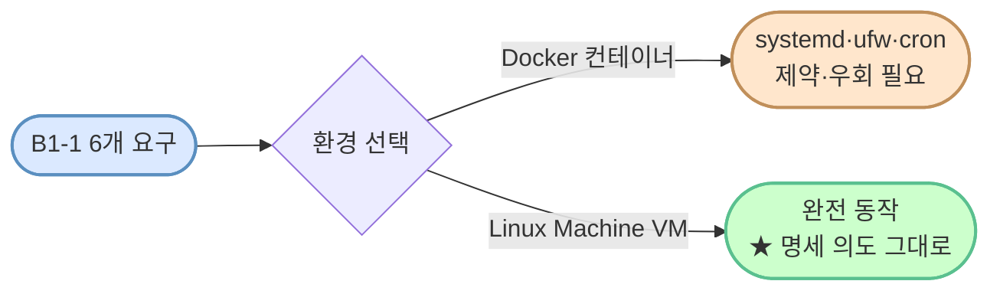
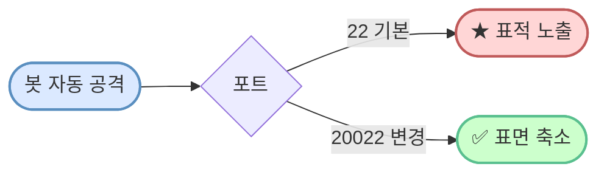
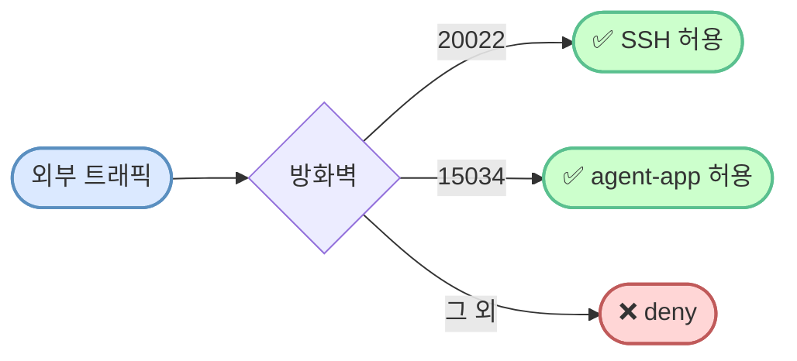
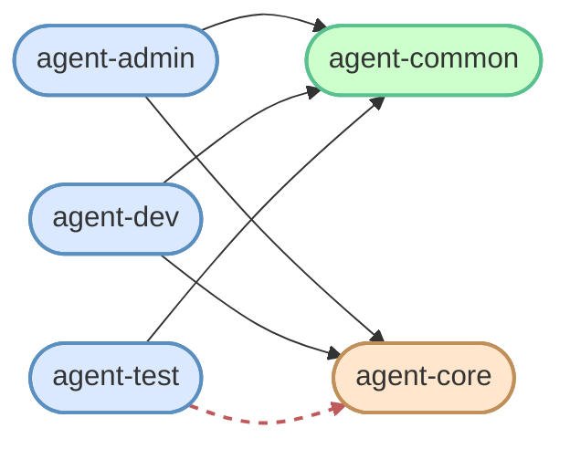
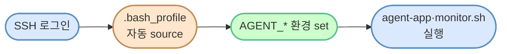
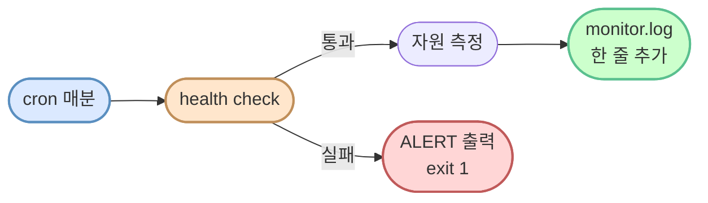
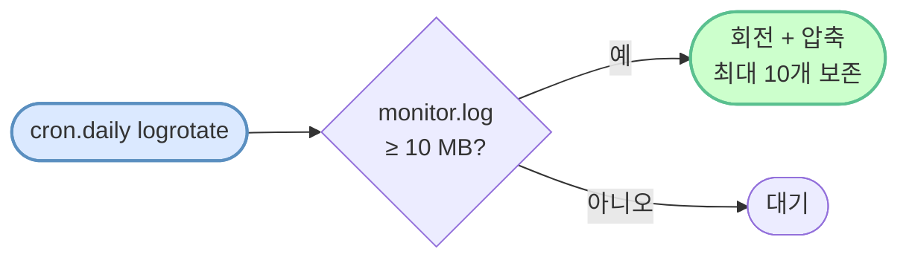

# B1-1 명세 요구사항 — 의도와 구현 매핑

> **한 줄로** · 명세 [docs/spec.md](./spec.md) 의 6개 요구 영역을 **무엇 / 왜 / 어떻게** 로 풀어쓴 학습·평가 친화 가이드. 회사 비유와 다이어그램으로 직관적 이해.

> 본 문서는 명세 원문이 아니라 **풀이 가이드**다. 정확한 명세는 [spec.md](./spec.md) 참조.

---

## 큰 그림 — B1-1은 무엇을 만드는가

회사 비유로 정리하면:


setup-all.sh 는 위 시스템이 돌아가는 **환경 자체를 한 번에 구축** — 사용자·권한·방화벽·cron 등.

- **agent-app** — 회사의 운영 중인 서비스 (예: 결제 서버). Codyssey 제공
- **monitor.sh** — 그 서비스를 24시간 감시하는 **CCTV 시스템** (학생 핵심 산출물)
- **setup 스크립트** — 서버 운영 환경 구축 (사용자·권한·방화벽·cron)
- **monitor.log** — 매분 기록되는 관제 보고서

→ 이 과제는 **운영 엔지니어(SRE)** 역할 학습. 앱을 만드는 게 아니라 **앱이 잘 돌아가도록 환경을 만들고 24시간 감시**.

---

## 어떤 환경에서? — 왜 VM (Linux Machine) 인가

명세는 "Ubuntu 22.04 LTS **또는 동등 리눅스 환경**(컨테이너/VM 둘 다 허용)" 이라고 했지만, 실제로 명세 6개 요구가 모두 **시스템 데몬 수준** 이라 **VM 이 명세 의도를 그대로 실현** 할 수 있는 환경에 가깝다.



### 명세 요구 ↔ 시스템 기능 매핑

| 명세 요구 | 필요한 시스템 기능 | Docker 컨테이너 | **VM** |
|---|---|---|---|
| SSH 포트 변경 + sshd 재시작 (#1) | systemd 로 sshd 데몬 관리 | 기본 비활성 (특수 이미지 필요) | ✅ |
| ufw 방화벽 (#2) | netfilter·iptables 직접 조작 | iptables 호스트와 공유 → 제약 | ✅ |
| cron 매분 실행 (#6) | cron 데몬 + systemd timer | 기본 안 돌아감, 추가 설정 필요 | ✅ |
| logrotate (#6) | `/etc/cron.daily/` 자동 실행 | systemd 필요 | ✅ |

### 회사 비유

- **Docker 컨테이너** = 공유 사무실의 **책상 한 자리**. 인프라(시스템 데몬·방화벽·전화선)는 건물 전체와 공유, 자기 자리만 격리. 작은 작업은 가능하지만 "내가 직접 보안·전화선 깔겠다" 같은 요구는 제약 많음.
- **Linux Machine (VM)** = **독립 사무실**. 인프라를 자기가 다 갖춤. 시스템 데몬·방화벽·cron 모두 자기 것 → 명세의 "서버 운영 환경 구축" 의도 그대로.

### OrbStack 의 강점

OrbStack 의 **Linux Machine** 은 Apple Silicon Mac 위에서 거의 컨테이너 속도로 부팅되는 가벼운 VM 이라, "VM 은 무겁다" 는 통념이 사실상 해당 없음. 한 줄로 평가 클러스터와 거의 동일한 amd64 Ubuntu 환경 확보 가능:

```bash
orb create --arch amd64 ubuntu:24.04 codyssey-b1-1
```

> 자세한 Docker 컨테이너 vs VM 비교 표·추가 설정 부담은 [README 의 "왜 VM 인가" 섹션](../README.md#왜-vm-linux-machine-인가--docker-컨테이너가-아닌-이유) 참조.

---

## 6개 요구 영역 한눈에

| # | 영역 | 명세 핵심 | 구현 |
|---|---|---|---|
| 1 | SSH 보안 | Port 22 → 20022, root 차단 | `setup/01-ssh.sh` |
| 2 | 방화벽 | ufw + 20022·15034 만 허용 | `setup/02-firewall.sh` |
| 3 | 사용자·그룹 | agent-admin/dev/test + agent-common/core | `setup/03-users-groups.sh` |
| 4 | 디렉토리·권한 | AGENT_HOME 구조 + ACL | `setup/04-directories.sh` |
| 5 | 환경 변수 | `.bash_profile` 에 AGENT_* | `setup/05-environment.sh` |
| 6 | cron·logrotate | 매분 monitor.sh + 10MB/10파일 회전 | `setup/06-cron.sh` + `bin/monitor.sh` |

---

## 영역 1: SSH 보안

### 무엇을
- SSH 서비스 포트를 기본 22 → **20022** 로 변경
- root 계정의 직접 SSH 로그인 차단 (`PermitRootLogin no`)

### 왜
인터넷에 노출된 22 포트는 **자동 brute-force 봇의 1순위 표적**. 매일 수천 번의 비번 시도가 들어옴. 두 가지 방어:



root 차단은 보조 방어: 사용자명조차 비공개라 표적 면적이 한 번 더 줄어들고, sudo 사용이 모두 감사 로그에 남음.

회사 비유:
- 22 포트 = **모두가 아는 정문 위치** → 20022로 옮겨 봇이 못 찾음
- root 차단 = **사장 직접 통화 금지** → 대리인(agent-admin)으로 거쳐서

### 어떻게
`setup/01-ssh.sh` 가 `sshd_config` 를 `sed` 로 수정 후 `sshd -t` 문법 검증 → `systemctl restart ssh`.

### 검증
- `sudo sshd -T | grep -E '^(port|permitrootlogin)'` → `port 20022` / `permitrootlogin no`
- `sudo ss -tulnp | grep ':20022'` → LISTEN 상태

### 학습 노트
[ssh-deep-dive](https://github.com/codewhite7777/codyssey_notes/blob/main/codyssey_b1_1_study/ssh-deep-dive.md), [sshd-config](https://github.com/codewhite7777/codyssey_notes/blob/main/codyssey_b1_1_study/sshd-config.md)

---

## 영역 2: 방화벽 (ufw)

### 무엇을
- ufw 활성화 + default deny incoming
- **20022/tcp (SSH)** 와 **15034/tcp (agent-app)** 만 허용

### 왜
방화벽은 "**필요한 문만 열고 나머지는 다 닫는다**" 원칙. agent-app 서버는 외부에서 SSH(관리) + 서비스 포트(15034) 두 가지만 받으면 됨.



회사 비유: **건물 1층 안내 데스크** 가 방문객 통제. 20022호(관리실)와 15034호(서비스부)만 안내, 나머지 호실은 출입 불가.

### 어떻게
`setup/02-firewall.sh` 가 `ufw --force reset` → `default deny incoming` → `allow 20022/tcp` + `allow 15034/tcp` → `ufw --force enable`.

### 학습 노트
[firewall-ufw-vs-firewalld](https://github.com/codewhite7777/codyssey_notes/blob/main/codyssey_b1_1_study/firewall-ufw-vs-firewalld.md), [ports-and-listening](https://github.com/codewhite7777/codyssey_notes/blob/main/codyssey_b1_1_study/ports-and-listening.md)

---

## 영역 3: 사용자·그룹

### 무엇을
**3명 사용자** + **2개 그룹**:
- 사용자: `agent-admin`, `agent-dev`, `agent-test`
- 그룹: `agent-common` (공용), `agent-core` (민감 자원 접근)

멤버십:
```
agent-common ⊇ {agent-admin, agent-dev, agent-test}    (3명 모두)
agent-core   ⊇ {agent-admin, agent-dev}                (test 차단)
```

### 왜
**역할 분리 (Separation of Duties)** — 운영의 기본 원칙. 사용자별로 접근 가능 범위를 다르게.



→ **빨간 점선 = agent-test 의 agent-core 접근 차단** (명세 요구).

회사 비유 (세 직급):
- agent-admin = **운영 관리자** (모든 자원 + 관리 권한)
- agent-dev = **개발자** (서비스 동작·로그 접근, 민감 자원도 OK)
- agent-test = **외부 테스터** (공용 자원만, API 키·로그는 차단)

→ agent-test가 agent-core 에 못 들어가는 게 **명세 핵심 검증** 중 하나.

### 어떻게
`setup/03-users-groups.sh` 가 `groupadd` → `useradd -G agent-common,agent-core` (test는 agent-common 만).

### 검증
- `id -nG agent-admin` → `agent-common agent-core` 포함
- `id -nG agent-test` → `agent-common` 만, `agent-core` 없음

### 학습 노트
[users-and-groups](https://github.com/codewhite7777/codyssey_notes/blob/main/codyssey_b1_1_study/users-and-groups.md), [posix-acl](https://github.com/codewhite7777/codyssey_notes/blob/main/codyssey_b1_1_study/posix-acl.md)

---

## 영역 4: 디렉토리·권한

### 무엇을

```
/home/agent-admin/agent-app/    (AGENT_HOME)
├── bin/                        (monitor.sh, report.sh)
├── upload_files/               (group=agent-common rwx)
├── api_keys/                   (group=agent-core 만 r, ★ 민감)
│   └── t_secret.key            (0440)
└── agent-app                   (Codyssey 제공 바이너리, 학생이 배치)

/var/log/agent-app/             (group=agent-core 만 rwx, setgid)
└── monitor.log                 (group=agent-core, 0640)
```

### 왜
**민감 자원 (api_keys, /var/log) 은 agent-core 만**, 공용 자원 (upload_files) 은 agent-common 도 OK. 그리고 **setgid 비트** 로 새로 만들어지는 파일이 자동으로 부모 디렉토리의 그룹을 상속.

각 디렉토리의 접근 정책:

| 디렉토리 | 모드 | 그룹 | 누가 접근? |
|---|---|---|---|
| `upload_files/` | `0770` | agent-common | admin·dev·test 모두 RW |
| `api_keys/` | `0750` | agent-core | admin·dev 만, test ❌ |
| `/var/log/agent-app/` | `2770` (setgid) | agent-core | admin·dev RW + 신규 파일 자동 상속 |

`setgid` 비트의 동작:


회사 비유:
- upload_files = **공용 작업실** (모두 들어옴)
- api_keys = **금고실** (코어 멤버만)
- /var/log = **기록 보관실 with setgid** = "여기 들어오는 새 문서는 자동으로 코어 도장 찍힘"

### 어떻게
`setup/04-directories.sh` 가 `install -d -m <mode> -o <user> -g <group>` 로 디렉토리 생성 + 권한·소유자 동시 설정. setgid 는 `chmod 2770` (앞의 2 가 setgid 비트).

### 학습 노트
[file-permissions](https://github.com/codewhite7777/codyssey_notes/blob/main/codyssey_b1_1_study/file-permissions.md), [filesystem-tree](https://github.com/codewhite7777/codyssey_notes/blob/main/codyssey_b1_1_study/filesystem-tree.md)

---

## 영역 5: 환경 변수·키 파일

### 무엇을

`/home/agent-admin/.bash_profile` 에 5개 환경 변수 정의:
```bash
export AGENT_HOME=/home/agent-admin/agent-app
export AGENT_PORT=15034
export AGENT_UPLOAD_DIR=$AGENT_HOME/upload_files
export AGENT_KEY_PATH=$AGENT_HOME/api_keys/t_secret.key
export AGENT_LOG_DIR=/var/log/agent-app
```

그리고 **API 키 파일** 생성:
```bash
echo "agent_api_key_test" > $AGENT_HOME/api_keys/t_secret.key
chmod 0440 $AGENT_HOME/api_keys/t_secret.key   # 소유자·그룹만 read
```

### 왜
**환경 변수로 실행 환경 고정** — agent-app·monitor.sh 가 하드코딩된 경로 대신 환경 변수 참조. 경로 변경 시 한 곳만 수정.



회사 비유: **출근 첫날 받는 안내문** (.bash_profile) 에 사번·부서·도구 위치 모두 적혀 있음. 매번 어디 있는지 외울 필요 X.

> [!NOTE]
> cron 으로 monitor.sh 실행 시는 `.bash_profile` 안 읽힘 (non-interactive non-login 셸).
> monitor.sh 자체가 `: "${AGENT_HOME:=...}"` 패턴으로 default 처리로 회피.

### 어떻게
`setup/05-environment.sh` 가 `.bash_profile` 에 `export AGENT_*` 추가 + 키 파일 생성 + 권한 설정.

### 학습 노트
[shell-environment](https://github.com/codewhite7777/codyssey_notes/blob/main/codyssey_b1_1_study/shell-environment.md), [cron-environment-gotchas](https://github.com/codewhite7777/codyssey_notes/blob/main/codyssey_b1_1_study/cron-environment-gotchas.md)

---

## 영역 6: cron + monitor.sh + logrotate (★ 핵심)

이 영역이 B1-1의 **꽃**. 세 가지가 맞물려 동작:

**monitor.sh 의 1회 사이클**:



**logrotate 의 회전 정책** (별도 trigger):



### 6-1. cron 매분 등록

#### 무엇을
agent-admin 의 crontab 에 monitor.sh 매분 실행 등록:
```cron
* * * * * /home/agent-admin/agent-app/bin/monitor.sh >> /var/log/agent-app/cron.log 2>&1
```

#### 왜
**자동 관제** — 사람이 1분마다 직접 보고 있을 수 없음. cron 데몬이 매분 monitor.sh 호출.

회사 비유: **자동 비서** 가 매분 1번씩 "지금 시스템 상태 어때?" 점검하고 보고서 작성.

### 6-2. monitor.sh — 핵심 산출물

#### 무엇을 검사하나

| 단계 | 내용 | 실패 시 |
|---|---|---|
| 1. 프로세스 존재 | `pgrep -f agent-app` | `[ALERT] agent-app 미실행` + exit 1 |
| 2. 프로세스 상태 | `ps -o state= -p $PID` (R/S vs Z) | zombie 면 [ALERT] |
| 3. 포트 LISTEN | `ss -tulnp` 로 15034 | `[ALERT] port 15034 not LISTEN` |
| 4. 방화벽 | `ufw status` | [WARNING] 만 |
| 5. CPU 사용률 | `top -b -n 2` | > 20% 면 [WARNING] |
| 6. MEM 사용률 | `free` | > 10% 면 [WARNING] |
| 7. DISK 사용률 | `df /` | > 80% 면 [WARNING] |
| 8. monitor.log 추가 | `echo ... >> monitor.log` | — |

→ **health check 3개 모두 통과 후에야 자원 측정** 으로 진행. 하나라도 실패면 즉시 exit (자원 측정 X). 명세 의도.

#### 명세 로그 포맷
```
[YYYY-MM-DD HH:MM:SS] PID:48291 CPU:25.3% MEM:5.2% DISK_USED:23%
```

### 6-3. logrotate — 로그 회전

#### 무엇을
`/etc/logrotate.d/agent-app`:
```
/var/log/agent-app/monitor.log {
    su agent-dev agent-core
    size 10M
    rotate 10
    compress
    delaycompress
    missingok
    notifempty
    copytruncate
    create 0640 agent-dev agent-core
}
```

#### 왜
**로그 파일이 무한 커지는 것 방지**. 10MB 도달 시 회전, 10개 파일까지 보존 (그 이상은 가장 오래된 것 삭제).

회사 비유: **공책 회전 정책** — 한 권에 10MB 쓰면 새 공책. 옛 공책 10권만 보관, 그 이상은 폐기.

> [!WARNING]
> `su agent-dev agent-core` 지시어가 핵심. `/var/log/agent-app` 가 group-writable(2770) 이라
> logrotate 기본 보안 정책에서 거부 — 이 지시어로 회전 시 사용 권한 명시.

### 학습 노트
[cron-fundamentals](https://github.com/codewhite7777/codyssey_notes/blob/main/codyssey_b1_1_study/cron-fundamentals.md), [log-rotation](https://github.com/codewhite7777/codyssey_notes/blob/main/codyssey_b1_1_study/log-rotation.md), [cpu-measurement](https://github.com/codewhite7777/codyssey_notes/blob/main/codyssey_b1_1_study/cpu-measurement.md), [memory-measurement](https://github.com/codewhite7777/codyssey_notes/blob/main/codyssey_b1_1_study/memory-measurement.md), [disk-usage-df-vs-du](https://github.com/codewhite7777/codyssey_notes/blob/main/codyssey_b1_1_study/disk-usage-df-vs-du.md)

---

## 자기평가 항목 매핑

명세 자기평가 항목과 관련 산출물·노트:

| 자기평가 항목 | 답변 재료 |
|---|---|
| "환경 변수(AGENT_HOME 등)로 실행 환경을 고정하는 이유와 검증 방법" | 영역 5 + [shell-environment](https://github.com/codewhite7777/codyssey_notes/blob/main/codyssey_b1_1_study/shell-environment.md) |
| "방화벽 규칙·SSH 포트 변경의 보안 효과" | 영역 1, 2 + [ssh-deep-dive](https://github.com/codewhite7777/codyssey_notes/blob/main/codyssey_b1_1_study/ssh-deep-dive.md) |
| "사용자·그룹·ACL 의 역할 분리 의도" | 영역 3, 4 + [posix-acl](https://github.com/codewhite7777/codyssey_notes/blob/main/codyssey_b1_1_study/posix-acl.md) |
| "monitor.sh 의 health check 와 자원 측정 흐름" | 영역 6-2 + [process-and-signals](https://github.com/codewhite7777/codyssey_notes/blob/main/codyssey_b1_1_study/process-and-signals.md) |
| "logrotate 정책의 의도" | 영역 6-3 + [log-rotation](https://github.com/codewhite7777/codyssey_notes/blob/main/codyssey_b1_1_study/log-rotation.md) |
| "set -euo pipefail 을 사용한 이유" | [bash-set-safe](https://github.com/codewhite7777/codyssey_notes/blob/main/codyssey_b1_1_study/bash-set-safe.md) + 회고 함정 3 |
| "트러블슈팅: 무엇이 어디서 막혔고 어떻게 해결했나" | [회고 노트 5개 함정](https://github.com/codewhite7777/codyssey_notes/blob/main/retrospectives/2026-05-12-b1-1-troubleshooting.md) |

---

## 한 줄 정리

> **B1-1 = 다중 사용자 Linux 서버에서 보안·권한·자원 관측을 자동화하는 운영 엔지니어링 1주차.**
> agent-app(서비스) 을 안전한 환경에 배치하고, monitor.sh(CCTV) 가 매분 자동 감시하며,
> logrotate(보존 정책) 가 기록을 관리하는 **완성된 관제 시스템** 을 구축한다.

---

## 참고
- [docs/spec.md](./spec.md) — Codyssey 원본 명세
- [README.md](../README.md) — 평가 환경 셋업 + 트러블슈팅
- [학습 노트 21개](https://github.com/codewhite7777/codyssey_notes/tree/main/codyssey_b1_1_study)
- [트러블슈팅 회고](https://github.com/codewhite7777/codyssey_notes/blob/main/retrospectives/2026-05-12-b1-1-troubleshooting.md)
