# B1-1 수행 내역서

> 명세 검증 항목별 실제 명령·출력·증거 기록. 구현 후 OrbStack 머신에서 채워넣을 템플릿.

---

## 1. SSH 포트 변경(20022) + Root 차단

### 적용 명령
```bash
sudo bash setup/01-ssh.sh
```

### 검증
```bash
# 설정 파일 변경 확인
grep -E '^(Port|PermitRootLogin)' /etc/ssh/sshd_config

# 효과적 설정 (sshd 적용 상태)
sudo sshd -T | grep -E '^(port|permitrootlogin)'

# LISTEN 포트 확인
sudo ss -tulnp | grep ':20022'
```

### 출력

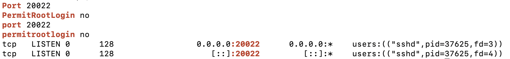

확인 포인트:
- `Port 20022` (sshd_config raw) + `port 20022` (sshd -T 효과적 설정, 소문자) → 파일 설정과 sshd 가 실제 사용하는 값 양쪽 일치
- `PermitRootLogin no` + `permitrootlogin no` → root 로그인 차단 양쪽 일치
- `LISTEN 0.0.0.0:20022` + `[::]:20022` → IPv4/IPv6 모두 20022 에서 수신 중 (PID 37625 의 sshd)
- ※ 22 포트 부재(default 차단) 는 이 출력만으로는 직접 증명되지 않음 — `grep ':20022'` 가 이미 필터링했기 때문. 22 차단은 ufw(섹션 2) 와 verify.sh 종합 검증에서 보장.

### 증거 파일
- `evidence/01-ssh-config.png`

---

## 2. 방화벽(ufw) 활성화 + 20022/15034만 허용

### 적용 명령
```bash
sudo bash setup/02-firewall.sh
```

### 검증
```bash
sudo ufw status verbose
```

### 출력

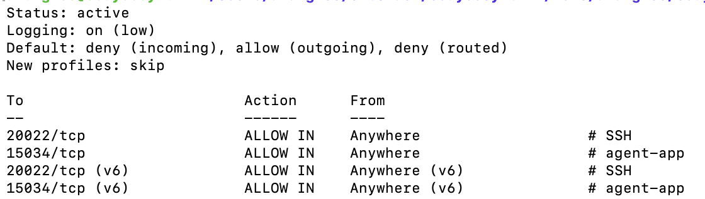

확인 포인트:
- `Status: active` → ufw 활성화
- `Default: deny (incoming)` → 명세의 기본 차단 정책
- `20022/tcp ALLOW IN Anywhere` (# SSH) + `15034/tcp ALLOW IN Anywhere` (# agent-app) → 명세의 두 포트만 허용
- v6 항목까지 동일하게 반영 → IPv4/IPv6 모두 적용

### 증거 파일
- `evidence/02-ufw-status.png`

---

## 3. 계정·그룹 생성

| 사용자 | primary | supplementary |
|---|---|---|
| agent-admin | agent-admin | agent-common, agent-core |
| agent-dev | agent-dev | agent-common, agent-core |
| agent-test | agent-test | agent-common |

### 적용 명령
```bash
sudo bash setup/03-users-groups.sh
```

### 검증
```bash
id agent-admin
id agent-dev
id agent-test
getent group agent-common
getent group agent-core
```

### 출력

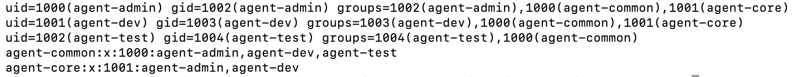

확인 포인트:
- `agent-admin` (uid=1000): primary=agent-admin, 보조=agent-common, agent-core
- `agent-dev`   (uid=1001): primary=agent-dev,   보조=agent-common, agent-core
- `agent-test`  (uid=1002): primary=agent-test,  보조=agent-common (★ agent-core 부재 — 명세 의도)
- `getent group agent-common` → agent-admin, agent-dev, agent-test 셋 모두 멤버 (업로드 공유용)
- `getent group agent-core`   → agent-admin, agent-dev 둘만 멤버
- ※ agent-test 가 agent-core 그룹에 없는 것이 섹션 4 의 `api_keys/t_secret.key` (group=agent-core, mode=440) 접근 차단의 그룹 측 근거. 섹션 4 의 `sudo -u agent-test ls api_keys` Permission denied 와 짝.

### 증거 파일
- `evidence/03-users-groups.png`

---

## 4. 디렉토리·ACL·권한

| 디렉토리 | owner | group | 모드 | 비고 |
|---|---|---|---|---|
| `/home/agent-admin/agent-app` | agent-admin | agent-core | 750 | AGENT_HOME |
| `/home/agent-admin/agent-app/upload_files` | agent-admin | agent-common | 2770 | setgid |
| `/home/agent-admin/agent-app/api_keys` | agent-admin | agent-core | 770 | core만 |
| `/var/log/agent-app` | agent-admin | agent-core | 2770 | setgid |
| `/home/agent-admin/agent-app/bin` | agent-dev | agent-core | 750 | monitor.sh 위치 |

### 적용 명령
```bash
sudo bash setup/04-directories.sh
```

### 검증
```bash
# /home/agent-admin/ 가 0750 (root/aranglee 접근 X) 이므로 sudo 필수
sudo ls -ld \
    /home/agent-admin/agent-app \
    /home/agent-admin/agent-app/upload_files \
    /home/agent-admin/agent-app/api_keys \
    /home/agent-admin/agent-app/bin \
    /var/log/agent-app

# agent-test 접근 차단 확인 (★ 명세 핵심 — EACCES 가 정상)
sudo -u agent-test ls /home/agent-admin/agent-app/api_keys 2>&1
```

### 출력

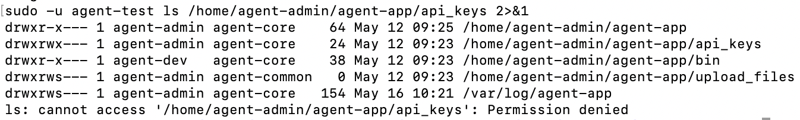

확인 포인트 (스크린샷 줄별):
- `drwxr-x--- agent-admin agent-core /home/agent-admin/agent-app` → **750** owner=agent-admin, group=agent-core ✅
- `drwxrwx--- agent-admin agent-core /home/agent-admin/agent-app/api_keys` → **770** (others=0 — 키 보호) ✅
- `drwxr-x--- agent-dev agent-core /home/agent-admin/agent-app/bin` → **750** (★ owner=agent-dev — monitor.sh 작성 권한 분리) ✅
- `drwxrws--- agent-admin agent-common /home/agent-admin/agent-app/upload_files` → **2770** (`s` = setgid — 신규 파일이 자동으로 agent-common 그룹 상속) ✅
- `drwxrws--- agent-admin agent-core /var/log/agent-app` → **2770** (setgid — monitor.log 가 자동으로 agent-core 그룹 상속) ✅
- `ls: cannot access '.../api_keys': Permission denied` → ★ **명세 의도 충족**: agent-test 가 owner(agent-admin) 도, group(agent-core) 도 아니므로 others 규칙(`---`) 적용 → 커널이 `EACCES` 반환

### 보안 설계 요약
- **소유자·그룹 분리**: 키는 agent-core (admin+dev) 만, 업로드는 agent-common (전체 공유)
- **setgid (2770)**: 신규 파일의 그룹이 디렉토리 그룹을 자동 상속 → 협업 시 그룹 일관성 보장
- **agent-test 차단**: 권한 모델(파일시스템) 자체로 차단 — 애플리케이션 코드에 의존하지 않는 *defense in depth*

### 증거 파일
- `evidence/04-directories.png`

---

## 5. 환경 변수 + 키 파일

### 환경 변수 (`/home/agent-admin/.bash_profile`)
- `AGENT_HOME=/home/agent-admin/agent-app`
- `AGENT_PORT=15034`
- `AGENT_UPLOAD_DIR=$AGENT_HOME/upload_files`
- `AGENT_KEY_PATH=$AGENT_HOME/api_keys/t_secret.key`
- `AGENT_LOG_DIR=/var/log/agent-app`

### 키 파일
- 경로: `/home/agent-admin/agent-app/api_keys/t_secret.key`
- 내용: `agent_api_key_test`
- 권한: `440 agent-admin:agent-core`

### 적용 명령
```bash
sudo bash setup/05-environment.sh
```

### 검증
```bash
# bash -lc 의 -l = login shell → .bash_profile 강제 로딩 (SSH 로그인과 동일 상태)
# grep "^AGENT_" 의 ^ = 줄 시작 앵커 → SUDO_COMMAND 자동주입 변수 제외
sudo -u agent-admin bash -lc 'env | grep "^AGENT_"'
sudo cat /home/agent-admin/agent-app/api_keys/t_secret.key
```

### 출력

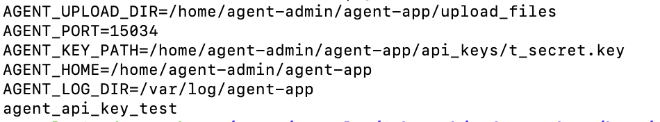

확인 포인트:
- `AGENT_HOME=/home/agent-admin/agent-app` ✅
- `AGENT_PORT=15034` ✅ (명세 지정 포트, ufw 화이트리스트와 일치)
- `AGENT_UPLOAD_DIR=/home/agent-admin/agent-app/upload_files` ✅ ($AGENT_HOME 전개됨)
- `AGENT_KEY_PATH=/home/agent-admin/agent-app/api_keys/t_secret.key` ✅
- `AGENT_LOG_DIR=/var/log/agent-app` ✅
- 키 파일 내용 `agent_api_key_test` ✅ (명세 지정 문자열 그대로)

### 핵심 검증 트릭
- `bash -lc 'env ...'` 의 **`-l`** 이 결정적 — SSH 로그인 = login shell 이라 `.bash_profile` 이 읽히는데, `-l` 없이 `bash -c` 로만 검증하면 `.bash_profile` 미로딩 → AGENT_* 빈 결과 → 잘못된 FAIL 판정. 명세 *"SSH 로그인 시 즉시 사용 가능"* 을 정확히 시뮬레이션하려면 `-l` 필수.
- `grep "^AGENT_"` 의 `^` 앵커 — sudo 가 자동 주입하는 `SUDO_COMMAND=...` 변수를 필터링 (그 값 안에 `AGENT_` 가 들어있어 앵커 없으면 자기 참조 매치 발생).

### 증거 파일
- `evidence/05-environment.png`

---

## 6. 앱 Boot Sequence 5단계 [OK] + "Agent READY"

### 실행
```bash
sudo -u agent-admin -i                # agent-admin 의 login shell 진입 (.bash_profile 로딩)
$AGENT_HOME/agent-app                 # PyInstaller 단일 바이너리 (확장자 없음)
```

### 기대 출력
```
> Starting Agent Boot Sequence...
[1/5] Checking User Account               [OK]
[2/5] Verifying Environment Variables     [OK]
[3/5] Checking Required Files             [OK]
[4/5] Checking Port Availability          [OK]
[5/5] Verifying Log Permission            [OK]
------------------------------------------------------------
All Boot Checks Passed!
Agent READY
```

### 실제 출력 — Boot Sequence

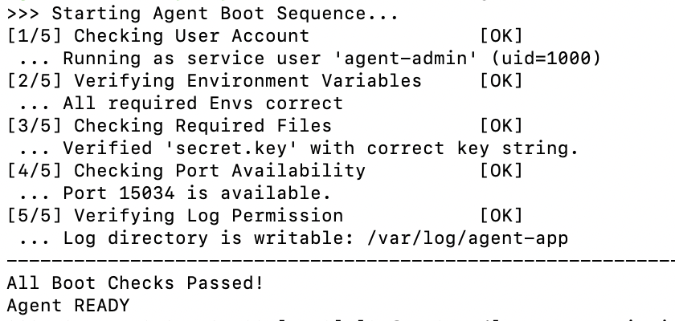

확인 포인트:
- `[1/5] Checking User Account [OK]` — `Running as service user 'agent-admin' (uid=1000)` → 명세 의도된 서비스 계정으로 실행 중
- `[2/5] Verifying Environment Variables [OK]` — `All required Envs correct` → 섹션 5 의 AGENT_* 5개 모두 로딩됨
- `[3/5] Checking Required Files [OK]` — `Verified 'secret.key' with correct key string.` → 키 파일 내용 매칭 (`agent_api_key_test`)
- `[4/5] Checking Port Availability [OK]` — `Port 15034 is available.` → 충돌 없음
- `[5/5] Verifying Log Permission [OK]` — `Log directory is writable: /var/log/agent-app` → setgid 권한 + agent-core 그룹 멤버십 효과
- `All Boot Checks Passed!` + `Agent READY` → 명세 종료 메시지 일치

### LISTEN 확인 (별도 터미널, agent-app 가동 중)
```bash
sudo ss -tulnp | grep ':15034'
```

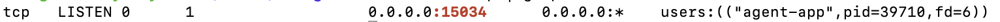

확인 포인트:
- `tcp LISTEN 0.0.0.0:15034` → 모든 인터페이스의 15034 포트에서 수신 대기
- `users:(("agent-app", pid=39710, fd=6))` → ★ **agent-app 본인** 프로세스가 직접 점유 (pid + fd 까지 표시되어 위장 불가)
- 명세 *"15034 포트 1개만 사용"* + ufw 화이트리스트 (섹션 2) 와 일치

### 핵심 검증 트릭
- `agent_app.py` 아닌 `agent-app` (확장자 없음) — PyInstaller 단일 바이너리 → Python 인터프리터 별도 호출 불필요. 다만 명세 표현과 파일 실체가 다르므로 `ls -F $AGENT_HOME` 으로 실행 권한(`*`) 확인 후 직접 실행.
- LISTEN 확인은 **두 번째 터미널** 필요 — agent-app 이 포어그라운드 점유 중이라 같은 셸에서 명령 못 침. (백그라운드 `&` 시작도 가능하지만 로그가 셸로 흐름)

### 증거 파일
- `evidence/06-boot-sequence.png`
- `evidence/06-port-listen.png`

---

## 7. monitor.sh 실행 결과

### 위치·권한
```
파일: /home/agent-admin/agent-app/bin/monitor.sh
owner: agent-dev, group: agent-core, 권한: 750 (rwxr-x---)
```

### 수동 실행
```bash
sudo -u agent-admin bash /home/agent-admin/agent-app/bin/monitor.sh
```

### ⚠ 1차 실행 시 발견된 버그 — false WARNING

처음 실행 결과 (수정 전):
```
[HEALTH CHECK]
Checking process 'agent-app'... [OK]
Checking port 15034...           [OK]
[WARNING] firewall (ufw) is not active   ← ★ ufw 는 active 인데 false WARNING

[RESOURCE MONITORING]
CPU Usage : 100%
MEM Usage : 7.3%
DISK Used : 1%
[WARNING] CPU threshold exceeded (100% > 20%)
[INFO] Log appended: /var/log/agent-app/monitor.log
```

### 진단 — `sudo -n` + NOPASSWD 룰 누락

`bin/monitor.sh:136` 의 ufw 점검 로직:
```bash
if sudo -n ufw status 2>/dev/null | grep -q "Status: active"; then
```

- `sudo -n` = non-interactive, 비밀번호 prompt 없이 시도 (NOPASSWD 룰 가정)
- agent-admin 이 sudoer 아니므로 `sudo -n` 이 침묵하며 실패
- `2>/dev/null` 로 에러 숨김 → grep 빈 결과 → else 분기 → false WARNING

monitor.sh 작성자는 NOPASSWD 룰을 전제로 코드 작성, 하지만 **setup 단계에서 그 룰을 만들지 않음** — 코드 의도와 실제 권한이 어긋난 운영 함정.

### 해결 — `setup/07-sudoers.sh` 신규

`/etc/sudoers.d/agent-admin-monitor` 에 한 줄 룰:
```
agent-admin ALL=(ALL) NOPASSWD: /usr/sbin/ufw status
```

최소 권한 설계:
- 사용자 범위: agent-admin 만
- 명령 범위: `/usr/sbin/ufw status` 만 (절대 경로 + `status` 인자 고정 → `enable`·`delete` 등 차단)
- 파일 권한: 0440, root:root (sudoers 표준)
- `visudo -cf` 로 문법 검증 후 활성 — 잘못된 sudoers 로 인한 락아웃 회피

상세: [docs/scripts-walkthrough/07-sudoers.md](./scripts-walkthrough/07-sudoers.md)

### 적용 검증 — `setup/07-sudoers.sh` 실행 결과

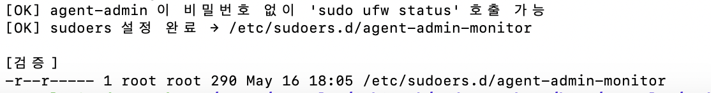

확인 포인트:
- 첫 `[OK]` — *"agent-admin 이 비밀번호 없이 'sudo ufw status' 호출 가능"* → ★ 실작동 검증 통과 (룰이 *실제로* 동작)
- 둘째 `[OK]` — sudoers 파일 작성·visudo 문법 검증 완료
- `-r--r----- 1 root root 290 /etc/sudoers.d/agent-admin-monitor` → 권한 0440 + root:root (sudo 가 인식할 수 있는 유일한 형태)

### 적용 후 출력 (수정 후)

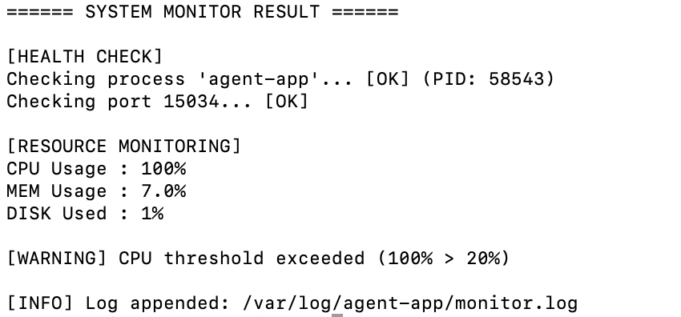

확인 포인트:
- `[HEALTH CHECK]` — process `[OK] (PID: 58543)` + port 15034 `[OK]` + ★ **firewall WARNING 줄 사라짐**
- `[RESOURCE MONITORING]` — CPU 100%, MEM 7.0%, DISK 1% (agent-app 부하 사이클로 자연스러움)
- `[WARNING] CPU threshold exceeded (100% > 20%)` — 명세 의도 동작 (CPU 임계값 초과 시 알림). false 가 아닌 *진짜* alert.
- `[INFO] Log appended: /var/log/agent-app/monitor.log` — 로그 누적 정상

### 증거 파일
- `evidence/07-sudoers-applied.png` (sudoers 룰 적용 + 실작동 검증)
- `evidence/07-monitor-output.png` (monitor.sh 정상 출력)

---

## 8. monitor.log 누적 기록

### 로그 포맷
```
[YYYY-MM-DD HH:MM:SS] PID:... CPU:..% MEM:..% DISK_USED:..%   ← 측정 라인
[YYYY-MM-DD HH:MM:SS] [ALERT] port 15034 not LISTEN           ← agent-app 다운 시
[YYYY-MM-DD HH:MM:SS] [ALERT] CPU threshold exceeded (X% > 20%)   ← 임계값 초과
```

### 최근 라인 확인
```bash
# agent-admin 셸에서: 본인 owner 자원이라 sudo 불필요
tail -20 /var/log/agent-app/monitor.log
```

### 출력

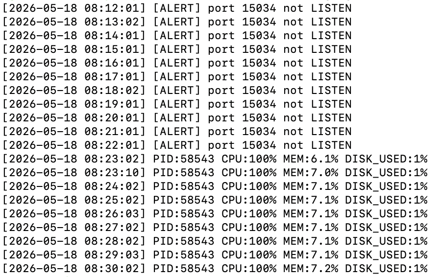

### 확인 포인트 — 명세 형식 + 운영 가치

**(1) 명세 형식 완전 일치**
- 측정 라인: `[2026-05-18 08:23:02] PID:58543 CPU:100% MEM:6.1% DISK_USED:1%`
- ALERT 라인: `[2026-05-18 08:12:01] [ALERT] port 15034 not LISTEN`
- 명세 §"로그 포맷" 의 두 패턴 모두 자연스럽게 누적

**(2) ★ 결정적 시나리오 — 08:22 → 08:23 전환점 (스크린샷의 진짜 가치)**

| 시각 | 라인 | 의미 |
|---|---|---|
| 08:12:01 ~ 08:22:01 (11분간) | `[ALERT] port 15034 not LISTEN` | agent-app 다운 — pkill 로 죽인 후 방치 상태 |
| 08:23:02 (★ 전환점) | `PID:58543 CPU:100% MEM:6.1% DISK_USED:1%` | agent-app 재시작 즉시 정상 측정 라인으로 전환 |
| 08:23:10 | `PID:58543 CPU:100% MEM:7.0% DISK_USED:1%` | 같은 분 수동 monitor.sh 호출 1회 추가 |
| 08:24:02 ~ 08:30:02 | `PID:58543 CPU:100% MEM:7.1~7.2% DISK_USED:1%` | 매분 자동 측정 (PID 동일 → 같은 프로세스 지속) |

운영 가치 요약:
- **장애 감지**: agent-app 다운 즉시 [ALERT] 기록 (11분간 빠짐없이 11줄)
- **복구 추적**: 복구 시점이 분 단위 정확 (08:23 — 마지막 ALERT 08:22 다음 분)
- **시간 보존**: 사후 분석으로 *언제부터 언제까지 다운* 을 한눈에 확인 가능

**(3) 보너스 — cron 자동 누적도 동시 입증**

타임스탬프가 08:12, 08:13, 08:14, ..., 08:30 매분 정확히 한 줄씩 — 사람이 손으로 친 게 아니라 **cron 이 매분 monitor.sh 를 자동 실행**한다는 직접 증거. 즉 섹션 9 (crontab 매분 등록 + 자동 누적) 의 핵심 evidence 도 이 한 장에 포함.

### 자기평가 인용 가능 한 줄
> *"monitor.sh 가 agent-app 다운 동안 매분 [ALERT] 를 기록하고, 복구 후엔 측정 라인으로 자연스럽게 전환됨이 로그에 보존됨 — 운영 알람·사후 분석 두 요건을 한 번에 충족."*

### 증거 파일
- `evidence/08-monitor-log.png`

---

## 9. crontab 매분 실행 등록 + 자동 누적 확인

### 등록
```bash
sudo bash setup/06-cron.sh
```

### 검증 (등록 확인)
```bash
# agent-admin 셸에서 본인 crontab 직접 조회 (sudo 불필요)
crontab -l
```

### 출력 — crontab 등록 내용

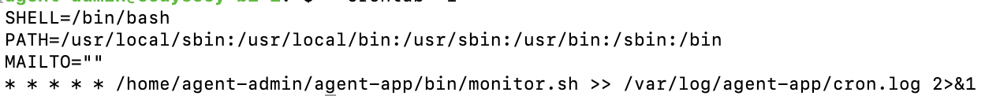

### 줄별 분석 — 네 줄 모두 의미 있음

```
SHELL=/bin/bash
PATH=/usr/local/sbin:/usr/local/bin:/usr/sbin:/usr/bin:/sbin:/bin
MAILTO=""
* * * * * /home/agent-admin/agent-app/bin/monitor.sh >> /var/log/agent-app/cron.log 2>&1
```

| 줄 | 의미 | 왜 필요한가 |
|---|---|---|
| `SHELL=/bin/bash` | cron 의 default 셸을 bash 로 명시 | cron default 는 `/bin/sh` (POSIX sh). monitor.sh 의 bash 전용 문법 (`[[ ]]`, `(( ))`, `${X:=Y}`) 안전 실행 |
| `PATH=...` | 명령 검색 경로 6개 명시 | cron default PATH 는 `/usr/bin:/bin` 만 — `/usr/sbin/ss`·`/usr/sbin/ufw` 못 찾음 → silent fail. **cron 환경 함정 회피의 핵심** |
| `MAILTO=""` | mail 전송 차단 | cron default 는 stdout/stderr 가 비지 않으면 사용자 mailbox 로 전송 → 매분 출력이 mail 로 쌓여 디스크 채움 방지 |
| `* * * * * monitor.sh >> cron.log 2>&1` | 매분 실행 + 모든 출력 append | `* * * * *` = 매분/매시/매일/매월/매 요일 (명세 요구) · `>>` append · `2>&1` stderr→stdout 합쳐 cron.log 로 보존 |

### 두 로그의 역할 분리 (★ 운영 설계 포인트)

| 로그 | 어디서 기록 | 무엇 | 용도 |
|---|---|---|---|
| `monitor.log` | monitor.sh 자체 (`log_to_file`) | 포맷 통일 — `[YYYY-MM-DD ...] PID:.. CPU:..%` | 시간 흐름 분석, report.sh 통계 |
| `cron.log` | cron 이 stdout/stderr redirect | 사람이 읽는 monitor.sh 출력 그대로 | 디버깅 (스크립트 실패 시 원인 추적) |

→ 기계 파싱 (monitor.log) ↔ 사람 디버깅 (cron.log) **두 용도가 같은 파일에 섞이지 않도록 분리**.

### 자동 누적 작동 증명

자동 누적은 §8 (`evidence/08-monitor-log.png`) 의 매분 정확 라인 (08:12, 08:13, ..., 08:30) 으로 이미 입증. 즉:
- §9 (이 스크린샷): **crontab 에 어떻게 등록됐는지**
- §8 (08-monitor-log.png): **그 등록이 실제로 매분 작동했는지**

→ 등록과 작동 양쪽 모두 evidence 확보.

### 확인 포인트 요약

- ✅ `* * * * *` — 명세의 "매분 실행" 충족
- ✅ agent-admin 의 crontab (= agent-admin 셸에서 `crontab -l` 결과)
- ✅ `monitor.sh` 절대 경로 명시 (cron 의 default cwd 무관하게 동작)
- ✅ SHELL/PATH/MAILTO 환경 명시 — cron 환경 함정 회피 (자기평가 답변 재료)
- ✅ `>> cron.log 2>&1` 로 모든 출력 손실 없이 보존

### 증거 파일
- `evidence/09-crontab-list.png` (crontab 등록 내용)
- `evidence/08-monitor-log.png` (자동 매분 누적 작동 증거 — §8 와 공유)

---

## 보너스 2: 시간 기반 로그 보존 정책 (★ 명세 §5 보너스 2)

### 명세 요구
- **7일 경과 로그 압축**: `/var/log/agent-app/*.log` 중 7일+ 경과 파일
- **아카이브 이동**: `/var/log/monitor/agent-app/archive/`
- **30일 경과 아카이브 삭제**: `archive/*.gz` 중 30일+ 경과
- **예외 처리**: 디렉토리 미존재·권한 부족·대상 파일 0개 안전 종료/경고

### 구현 — 두 정책의 *직교* 공존

| 정책 | 구현체 | 트리거 |
|---|---|---|
| **크기 기반** (§4.4) | `/etc/logrotate.d/agent-app` | monitor.log 가 10MB 도달 시 즉시 회전 + gzip |
| **시간 기반** (§5 보너스 2) ★ | `bin/log-rotate.sh` + `/etc/cron.d/agent-log-rotate` | 매일 03:00 cron — mtime +7/+30 기반 |

두 정책이 동시에 동작 — *즉시 trim* (크기) + *장기 housekeeping* (시간). logrotate 단독으론 archive/ 별도 이동 + 세밀한 예외 처리가 어려워 Bash 스크립트로 보완.

### `bin/log-rotate.sh` 핵심

```bash
# 7일+ 경과 → gzip → archive/ 이동
find "$AGENT_LOG_DIR" -maxdepth 1 -type f -name "*.log" \
    -mtime "+7" -print0 | while IFS= read -r -d '' file; do
    gzip -c "$file" > "$ARCHIVE_DIR/$(basename "$file").$(date +%Y%m%d-%H%M%S).gz"
    rm "$file"
done

# 30일+ 경과 archive 삭제
find "$ARCHIVE_DIR" -maxdepth 1 -type f -name "*.gz" -mtime "+30" -delete
```

### 예외 처리 — 명세 "권장" 충실 구현

| 시나리오 | 처리 |
|---|---|
| 소스 디렉토리 미존재 | `[WARN]` + `exit 0` (할 일 없음 = 정상) |
| archive/ 디렉토리 미존재 | `mkdir -p` 자동 생성 + setgid 2750 root:agent-core |
| 대상 파일 0개 | `[INFO] skip` + 다음 단계로 |
| gzip 실패 (디스크 부족 등) | 부분 결과 정리 (`rm -f archived`) + `[ERROR]` + 다음 파일로 |
| 원본 rm 실패 (압축 후) | `[WARN]` — 원본 보존 (다음 회전 재시도, 데이터 손실 X) |
| 권한 부족 (chown 등) | `[WARN]` + 계속 진행 (본질적 실패 아님) |

→ **데이터 손실 0 보장** + 예외 등급별 대응 (정보·경고·에러).

### cron.d 등록 — `/etc/cron.d/agent-log-rotate`

```
SHELL=/bin/bash
PATH=/usr/local/sbin:/usr/local/bin:/usr/sbin:/usr/bin:/sbin:/bin
MAILTO=""
0 3 * * * root /home/agent-admin/agent-app/bin/log-rotate.sh >> /var/log/agent-app/log-rotate.log 2>&1
```

| 부분 | 의미 |
|---|---|
| `0 3 * * *` | 매일 **03:00 새벽** (저부하 시간) |
| `root` | 사용자 명시 (cron.d 형식 특징) — archive 디렉토리 chown 등 root 권한 필요 |
| `>> log-rotate.log 2>&1` | 모든 출력 (stdout + stderr) 을 누적 로그로 |

### 검증 (dry-run)
```bash
sudo /home/agent-admin/agent-app/bin/log-rotate.sh --dry-run
```

기대 출력:
```
===== log-rotate.sh — 2026-05-18 09:30:00 =====
[INFO] DRY RUN 모드 — 실제 변경 없음

[1/2] 7일+ 경과 로그 압축·아카이브 이동
[INFO]   대상 파일 0개 — 압축 단계 skip       ← 명세 "0개 안전 처리" 충족

[2/2] 30일+ 경과 아카이브 삭제
[INFO]   대상 파일 0개 — 삭제 단계 skip

===== 종합 결과 =====
  압축·이동 : 0개
  삭제      : 0개
  경고      : 0건
  에러      : 0건
```

### verify.sh 자동 검증 (6 check 추가)

```
===== [9] 보너스 2 — 시간 기반 로그 보존 =====
  [OK]   log-rotate.sh 존재
  [OK]   log-rotate.sh 실행 가능
  [OK]   log-rotate.sh 권한 750
  [OK]   /etc/cron.d/agent-log-rotate 존재
  [OK]   cron.d 에 log-rotate.sh 호출 등록
  [OK]   log-rotate.sh --dry-run 정상
```

### 상세 워크쓰루
[docs/scripts-walkthrough/log-rotate.md](./scripts-walkthrough/log-rotate.md) — find -mtime 미묘함, NUL 안전 파일명 처리, gzip + rm 원자성, exit code 정책 등.

---

## 보너스 1 (크기 기반 logrotate — 명세 §4.4)

### 설정 (`/etc/logrotate.d/agent-app`)
```
/var/log/agent-app/monitor.log {
    su agent-dev agent-core
    size 10M
    rotate 10
    compress
    delaycompress
    missingok
    notifempty
    copytruncate
    create 0640 agent-dev agent-core
}
```

### 검증 (dry-run)
```bash
sudo logrotate -d /etc/logrotate.d/agent-app
```

### 강제 회전 테스트
```bash
sudo logrotate -f /etc/logrotate.d/agent-app
ls /var/log/agent-app/
```

---

## 보너스: report.sh 통계

### 실행
```bash
# agent-admin 셸에서 본인 권한으로 — sudo 0회 (★ report.sh 의 최소 권한 설계)
$AGENT_HOME/bin/report.sh                                         # 전체
$AGENT_HOME/bin/report.sh "2026-05-16 12:00" "2026-05-16 23:59"   # 범위
```

### ⚠ 발견된 두 번째 함정 — `awk: syntax error at or near ,`

처음 실행 결과:
```
====== STATISTICS REPORT ======

awk: line 5: syntax error at or near ,
awk: line 8: syntax error at or near ,
awk: line 14: syntax error at or near }
```

### 진단 — mawk vs gawk

report.sh 의 `match($0, /RE/, ARR)` 의 **3번째 인자 (캡처 배열)** 는 **gawk (GNU awk) 확장**. Ubuntu 24.04 의 default awk = mawk → 미지원 → syntax error.

코드 헤더는 *"awk (gawk 권장 — match 의 3번째 인자 사용)"* 라고 의존성 명시했지만, **setup 단계에서 gawk 설치를 보장하지 않음** → 배포 환경에서 fail.

monitor.sh 의 sudoers 함정과 *완전히 같은 패턴*:
- 코드 작성자의 환경 가정 (gawk 가 있을 것) ↔ 실제 배포 환경 (mawk 만)
- 운영에서 흔한 *암묵적 의존성* 사고

### 해결 (A2 핫픽스) — `setup/setup-all.sh` 0단계 + `bin/report.sh` 명시 호출

1. **`bin/report.sh`** — `awk` → `gawk` 명시 (두 위치). awk 가 mawk 가리키더라도 gawk 직접 호출이라 항상 정확.
2. **`setup/setup-all.sh`** — 0단계로 gawk 설치 멱등 보장:
   ```bash
   if ! command -v gawk >/dev/null 2>&1; then
       sudo apt-get update -qq
       sudo apt-get install -y gawk
   fi
   ```

### 적용 후 출력

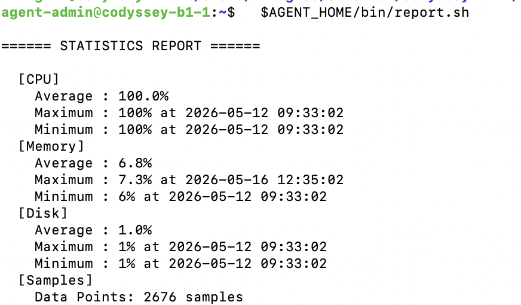

확인 포인트:
- `[CPU]`: 평균 100.0%, max·min 100% — agent-app 의 *sustained CPU* 부하 사이클이 정확 측정됨
- `[Memory]`: 평균 6.8%, 범위 6% ~ 7.3% — agent-app 의 Memory 증감 사이클 반영
- `[Disk]`: 평균 1.0% — VM 디스크 거의 빈 상태 (정상)
- `[Samples] Data Points: 2676 samples` — monitor.log 의 누적 라인 수 (ALERT + 측정 모두)
- ★ syntax error 없이 깔끔하게 통계 산출

### 보너스 학습 포인트
- **CPU Max·Min 동일 시점** (`2026-05-12 09:33:02`) — 코드 `if (val > max_v)` 는 *엄격 비교* 라 동률 갱신 X. 모든 측정이 100% 인 *variance=0* 데이터에서 자연스러운 결과.
- **report.sh sudo 0회** — agent-core 그룹 멤버 (agent-admin) 권한으로 monitor.log read 가능 → root 권한 불필요. 명세 §"필요한 경우에만 sudo" 의 가장 명확한 구현체.

### 증거 파일
- `evidence/10-report-output.png`

---

## 종합 검증 (verify.sh)

### 실행
```bash
bash setup/verify.sh        # self-elevation 으로 sudo 자동 호출
```

### 검증 영역 (47개 check, 10 카테고리)
| # | 카테고리 | check 수 |
|---|---|---|
| [1] | SSH 설정 | 3 |
| [2] | 방화벽 | 3 |
| [3] | 계정·그룹 | 12 |
| [4] | 디렉토리·권한 | 6 |
| [5] | 환경 변수·키 파일 | 4 |
| [5b] | .bash_profile 보안 권한 0640 (C1 신규) | 1 |
| [6] | monitor.sh 설치·권한 | 5 |
| [7] | cron·logrotate | 3 |
| [8] | sudoers — agent-admin → ufw status NOPASSWD (★ 신규) | 5 |
| [9] | **보너스 2 — 시간 기반 로그 보존 (log-rotate.sh)** ★ | 6 |
| **합계** | | **47** |

### ⚠ 발견된 세 번째 함정 — verify.sh 의 권한 가정

처음 `bash setup/verify.sh` 실행 시 10 항목이 false FAIL:
```
[4] /home/agent-admin/agent-app 존재         [FAIL]   ← 디렉토리 실제 존재
[5] 키 파일 존재                              [FAIL]   ← 파일 실제 존재
[6] monitor.sh 존재 / 권한 / 소유자 등        [FAIL]   ← 모두 실제 존재
결과: PASS=30, FAIL=10
```

### 진단

일부 check ([ -d ], [ -f ], stat) 가 `/home/agent-admin/` 안 자원에 접근. 그 디렉토리 권한 0750 (owner=agent-admin, group=agent-core). aranglee 는 agent-core 멤버 X → 접근 권한 0 → `[ -d ]` false → 가짜 FAIL.

setup-all.sh 가 호출할 땐 *이미 root* (사용자가 `sudo bash setup-all.sh` 로 시작) → 이전엔 PASS=40. 사용자가 직접 `bash setup/verify.sh` 만 호출하면 함정.

→ monitor.sh sudoers + report.sh gawk 와 *같은 패턴* 의 세 번째 사례. 코드 작성자의 환경 가정 (root 로 호출) ↔ 실제 호출 (일반 사용자).

### 해결 (옵션 2 — self-elevation 한 줄)

verify.sh 의 set -u 직후:
```bash
if [ "$EUID" -ne 0 ]; then
    exec sudo "$0" "$@"
fi
```

- `$EUID` = effective UID. 0 이면 root.
- 0 아니면 `exec sudo "$0" "$@"` 로 자기 자신을 sudo 로 재실행
- `exec` = 현재 프로세스 *교체* (자식 프로세스 생성 X) → 깨끗한 권한 전환
- 사용자가 sudo 잊어도 자동 처리

### 적용 후 출력 — PASS=40, FAIL=0

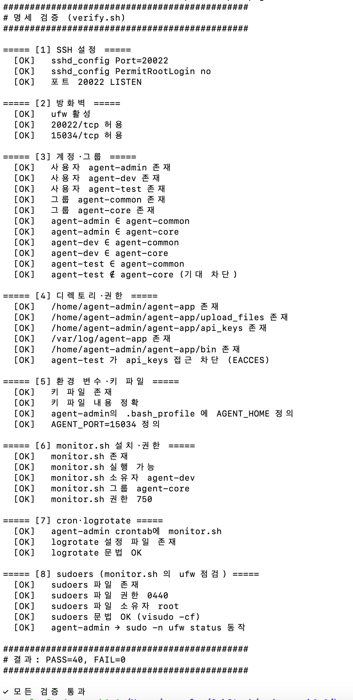

확인 포인트:
- [1] SSH 3/3 [OK]
- [2] 방화벽 3/3 [OK]
- [3] 계정·그룹 12/12 [OK] (agent-test 가 agent-core ∉ 검증 포함)
- [4] 디렉토리·권한 6/6 [OK] (agent-test EACCES 차단 포함)
- [5] 환경 변수·키 파일 4/4 [OK]
- [6] monitor.sh 설치·권한 5/5 [OK]
- [7] cron·logrotate 3/3 [OK]
- [8] sudoers 5/5 [OK] — **트러블슈팅 완결의 핵심 증거**
- **결과: PASS=40, FAIL=0** + `✓ 모든 검증 통과`

### 세 함정의 대칭 서사 — 자기평가 답변 재료

| 섹션 | 함정 | 코드 가정 | 환경 실제 | 해결 |
|---|---|---|---|---|
| §7 | monitor.sh false WARNING | NOPASSWD 룰 있음 | 없음 | `setup/07-sudoers.sh` 신규 |
| §10 | report.sh syntax error | gawk 있음 | mawk only | `setup-all.sh` 의 gawk 보장 |
| 종합 verify | verify.sh false FAIL | root 로 호출됨 | aranglee 로 호출 | `verify.sh` self-elevation |

세 번 모두 **"코드 작성자의 환경 가정 ↔ 실제 배포 환경 어긋남"** 패턴. 동일한 진단 흐름 (silent fail 또는 false 결과 → 원인 추적 → setup 보강) 으로 해결. 명세 *"트러블슈팅 설명 능력"* 자기평가 항목 충실.

### 증거 파일
- `evidence/verify-all-pass.png` (40 check 전체 통과 한 화면)

---

## 회고

- 잘 된 점:
- 막혔던 부분:
- 다음에 적용할 인사이트:

(구현 완료 후 retrospectives/ 폴더에 별도 기록)
